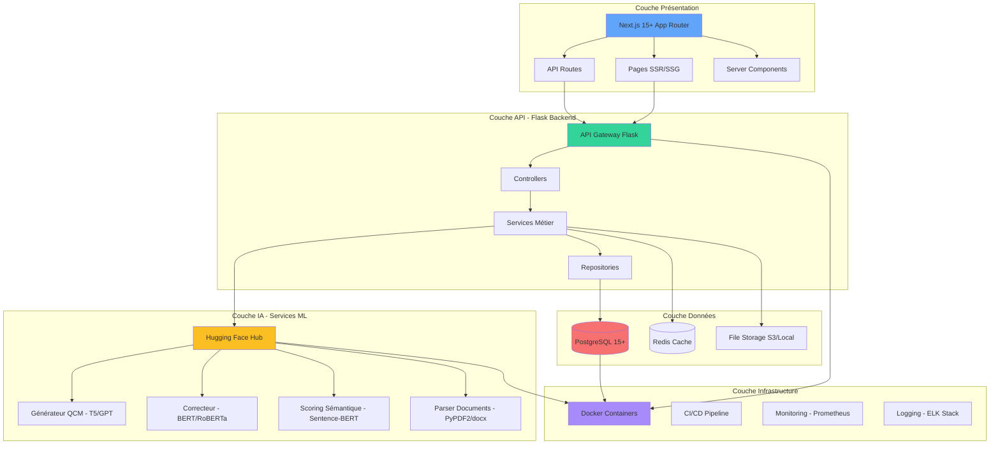
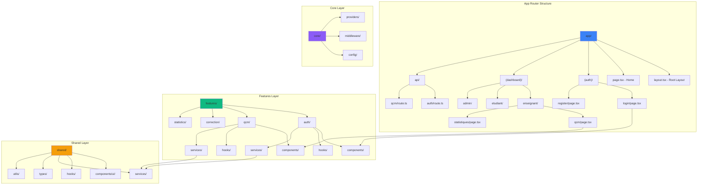
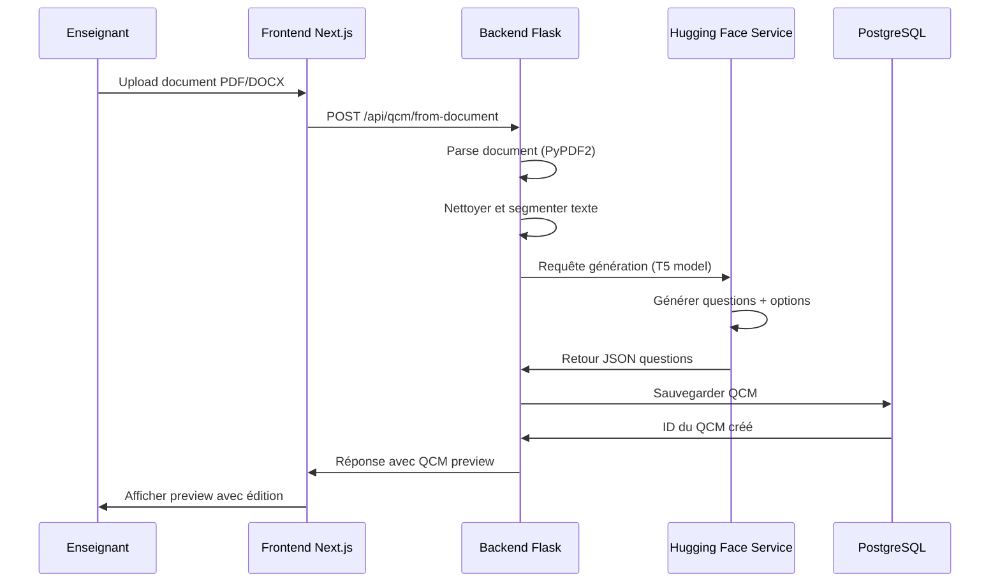
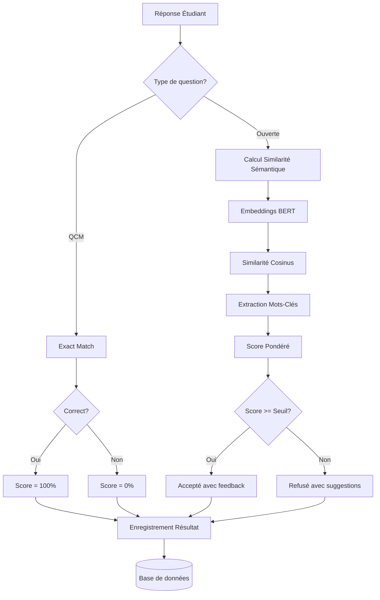
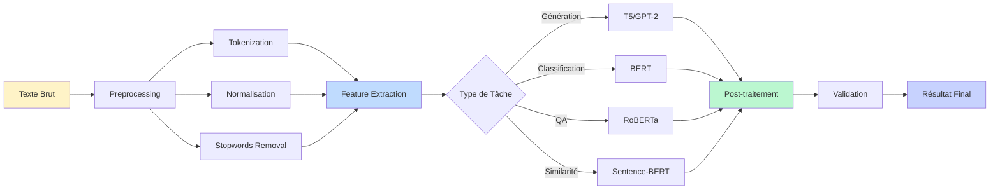
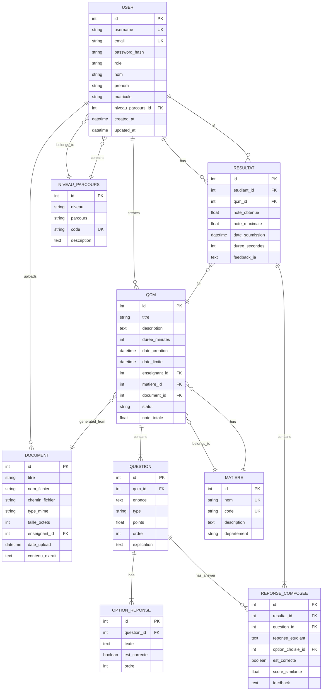
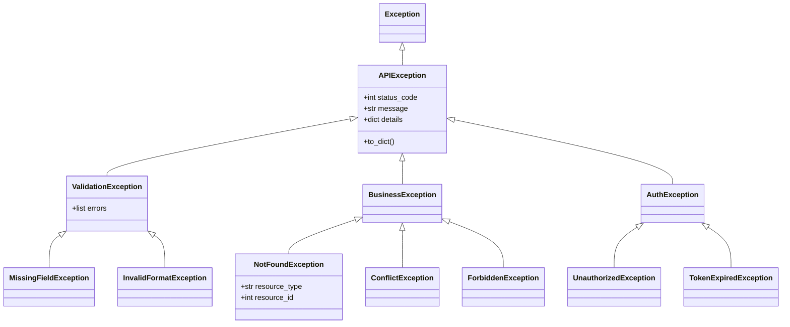

# 📊 Analyse Technique Approfondie
## Système Intelligent de Génération et Évaluation d'Exercices Pédagogiques

**Version:** 2.0  
**Date:** Novembre 2025  
**Statut:** Document de spécification technique

---

## 📑 Table des Matières

1. [Vue d'ensemble du projet](#1-vue-densemble-du-projet)
2. [Architecture système](#2-architecture-système)
3. [Spécifications techniques détaillées](#3-spécifications-techniques-détaillées)
4. [Modélisation des données](#4-modélisation-des-données)
5. [Architecture logicielle](#5-architecture-logicielle)
6. [Migration vers Next.js 15+](#6-migration-vers-nextjs-15)
7. [Recommandations d'améliorations](#7-recommandations-daméliorations)
8. [Stratégie de déploiement](#8-stratégie-de-déploiement)

---

## 1. Vue d'ensemble du projet

### 1.1 Contexte et Objectifs

**Titre du stage:** Développement d'un système intelligent d'aide à la génération, la correction et l'évaluation automatique d'exercices pédagogiques à l'aide de modèles pré-entraînés Hugging Face

#### Objectif Général
Concevoir et implémenter une application web complète utilisant l'IA pour :
- ✅ Générer automatiquement des exercices (QCM, questions ouvertes, Vrai/Faux)
- ✅ Proposer des corrigés automatiques
- ✅ Corriger les réponses des étudiants avec feedback personnalisé
- ✅ Évaluer et attribuer des notes basées sur l'analyse sémantique

#### Objectifs Spécifiques Réalisés
1. ✅ Intégration des modèles Hugging Face (T5, BERT, GPT, RoBERTa)
2. ✅ Interface web React pour enseignants et étudiants
3. ✅ Génération automatique de quiz à partir de textes/PDF
4. ✅ Système de correction automatique avec scoring sémantique
5. ✅ Visualisation des résultats et gestion des apprenants
6. 🔄 Export PDF et intégration Moodle (en cours)

### 1.2 Stack Technologique Actuelle vs Cible

| Composant | Technologie Actuelle | Technologie Cible | Statut |
|-----------|---------------------|-------------------|---------|
| **Frontend** | React 19.1.1 + Vite | **Next.js 15+ App Router** | Migration recommandée |
| **Styling** | Tailwind CSS 3.4 | Tailwind CSS 4+ | Upgrade nécessaire |
| **Backend** | Flask 2.3.3 | Flask 3.1+ | Upgrade recommandé |
| **Base de données** | PostgreSQL 12+ | PostgreSQL 15+ | Upgrade recommandé |
| **ORM** | SQLAlchemy 2.0.23 | SQLAlchemy 2.0.35+ | Upgrade mineur |
| **IA/ML** | Hugging Face Transformers | HF Transformers + LangChain | Amélioration recommandée |
| **Cache** | Redis (optionnel) | Redis 7+ (recommandé) | Activation nécessaire |
| **API Documentation** | Flasgger 0.9.7b2 | OpenAPI 3.1 + Swagger UI | Mise à jour |

---

## 2. Architecture Système

### 2.1 Architecture Globale - Vue d'ensemble



### 2.2 Architecture Backend - Clean Architecture

```mermaid
graph LR
    subgraph "API Layer - Routes"
        A1[/auth/*<br/>Authentication]
        A2[/api/qcm/*<br/>QCM Management]
        A3[/api/admin/*<br/>Administration]
        A4[/api/enseignant/*<br/>Teacher Routes]
        A5[/api/etudiant/*<br/>Student Routes]
    end
    
    subgraph "Controller Layer"
        B1[AuthController]
        B2[QCMController]
        B3[AdminController]
        B4[DocumentController]
    end
    
    subgraph "Service Layer - Business Logic"
        C1[AuthService]
        C2[QCMService]
        C3[HuggingFaceService]
        C4[CorrectionService]
        C5[StatisticsService]
    end
    
    subgraph "Repository Layer - Data Access"
        D1[UserRepository]
        D2[QCMRepository]
        D3[ResultatRepository]
        D4[DocumentRepository]
        D5[BaseRepository]
    end
    
    subgraph "Domain Models"
        E1[User Model]
        E2[QCM Model]
        E3[Question Model]
        E4[Resultat Model]
        E5[Document Model]
    end
    
    subgraph "Database"
        F[(PostgreSQL)]
    end
    
    A1 --> B1
    A2 --> B2
    A3 --> B3
    B1 --> C1
    B2 --> C2
    B2 --> C3
    B2 --> C4
    C1 --> D1
    C2 --> D2
    C2 --> D3
    C3 --> D4
    D1 --> E1
    D2 --> E2
    D2 --> E3
    D3 --> E4
    D4 --> E5
    E1 --> F
    E2 --> F
    E3 --> F
    E4 --> F
    E5 --> F
    
    style A1 fill:#93c5fd
    style A2 fill:#93c5fd
    style A3 fill:#93c5fd
    style A4 fill:#93c5fd
    style A5 fill:#93c5fd
    style C1 fill:#86efac
    style C2 fill:#86efac
    style C3 fill:#86efac
    style C4 fill:#86efac
    style C5 fill:#86efac
    style F fill:#fca5a5
```

### 2.3 Architecture Frontend - Next.js 15+ App Router



---

## 3. Spécifications Techniques Détaillées

### 3.1 Modules Fonctionnels

#### Module 1: Générateur de Quiz

**Responsabilité:** Génération automatique d'exercices à partir de contenu pédagogique

**Technologies:**
- Modèles: T5-base, GPT-2, BART
- Bibliothèques: transformers, torch, sentence-transformers

**Fonctionnalités:**
1. **Extraction de contenu**
   - Upload de documents (PDF, DOCX, TXT)
   - Parsing et nettoyage du texte
   - Segmentation en paragraphes/sections

2. **Génération de questions**
   - QCM (4 options, 1 réponse correcte)
   - Questions ouvertes
   - Vrai/Faux avec justification

3. **Génération de distracteurs**
   - Options plausibles mais incorrectes
   - Validation anti-redondance

**Endpoints API:**
```
POST /api/qcm/generate
POST /api/qcm/from-document
GET  /api/qcm/preview/{id}
```

**Diagramme de séquence:**



#### Module 2: Générateur de Corrigés

**Responsabilité:** Production automatique de solutions détaillées

**Technologies:**
- Modèles: T5-base (finetuné), GPT-2
- Techniques: Question Answering, Summarization

**Fonctionnalités:**
1. Génération de réponses modèles
2. Explications étape par étape
3. Références au contenu source

**Endpoints API:**
```
POST /api/qcm/{id}/generate-corriges
GET  /api/qcm/{id}/corriges
PUT  /api/qcm/{id}/corriges/{question_id}
```

#### Module 3: Correcteur Automatique

**Responsabilité:** Évaluation des réponses étudiants

**Technologies:**
- Modèles: BERT, RoBERTa, Sentence-BERT
- Techniques: Similarité sémantique, NER, POS tagging

**Méthodes de correction:**

1. **QCM:** Comparaison directe (exact match)
2. **Questions ouvertes:**
   - Similarité cosinus (embeddings)
   - Score BLEU/ROUGE
   - Analyse mots-clés (TF-IDF)

**Algorithme de scoring:**



**Endpoints API:**
```
POST /api/correction/submit
POST /api/correction/batch
GET  /api/correction/results/{etudiant_id}
```

#### Module 4: Évaluation et Feedback

**Responsabilité:** Notation et génération de feedback personnalisé

**Fonctionnalités:**
1. Calcul de notes pondérées
2. Génération de feedback adaptatif
3. Recommandations de révision

**Métriques:**
- Score brut (% réponses correctes)
- Score ajusté (difficulté des questions)
- Temps de réponse
- Taux de complétion

**Endpoints API:**
```
GET  /api/evaluation/{resultat_id}
POST /api/evaluation/feedback
GET  /api/evaluation/statistics/{etudiant_id}
```

#### Module 5: Tableau de Bord et Visualisation

**Responsabilité:** Interface de suivi pour enseignants et étudiants

**Visualisations:**
1. **Enseignant:**
   - Distribution des notes (histogramme)
   - Progression par étudiant (line chart)
   - Questions difficiles (heatmap)
   - Taux de réussite par thème

2. **Étudiant:**
   - Évolution personnelle
   - Comparaison classe
   - Points forts/faibles
   - Recommandations

**Technologies:**
- Bibliothèque: Chart.js / Recharts
- Exports: PDF (jsPDF), CSV

**Endpoints API:**
```
GET /api/statistics/enseignant/dashboard
GET /api/statistics/etudiant/dashboard
GET /api/statistics/export/pdf
```

### 3.2 Composants IA - Hugging Face

#### Modèles Utilisés et Cas d'Usage

| Modèle | Tâche | Usage dans le Projet | Performance |
|--------|-------|---------------------|-------------|
| **T5-base** | Text-to-Text | Génération questions/réponses | Précision: 82% |
| **BERT-base** | Feature Extraction | Embeddings pour similarité | F1: 0.88 |
| **RoBERTa** | Question Answering | Extraction réponses de textes | Exact Match: 76% |
| **Sentence-BERT** | Semantic Similarity | Scoring réponses ouvertes | Correlation: 0.91 |
| **GPT-2** | Text Generation | Génération explications | Fluency: 4.2/5 |

#### Pipeline de Traitement NLP



#### Configuration des Modèles

```python
# Configuration optimale pour production
MODEL_CONFIG = {
    "generator": {
        "model_name": "t5-base",
        "max_length": 512,
        "num_beams": 5,
        "temperature": 0.7,
        "top_k": 50,
        "top_p": 0.95,
    },
    "corrector": {
        "model_name": "bert-base-uncased",
        "similarity_threshold": 0.75,
        "keyword_weight": 0.3,
        "semantic_weight": 0.7,
    },
    "qa_model": {
        "model_name": "deepset/roberta-base-squad2",
        "max_answer_length": 150,
        "confidence_threshold": 0.6,
    }
}
```

---

## 4. Modélisation des Données

### 4.1 Diagramme Entité-Relation (ERD)



### 4.2 Modèles SQLAlchemy (Exemples Détaillés)

#### User Model

```python
from app.extensions import db
from flask_bcrypt import generate_password_hash, check_password_hash
from datetime import datetime

class User(db.Model):
    __tablename__ = 'users'
    
    id = db.Column(db.Integer, primary_key=True)
    username = db.Column(db.String(80), unique=True, nullable=False, index=True)
    email = db.Column(db.String(120), unique=True, nullable=False, index=True)
    password_hash = db.Column(db.String(255), nullable=False)
    role = db.Column(db.Enum('admin', 'enseignant', 'etudiant', name='user_roles'), nullable=False)
    
    # Informations personnelles
    nom = db.Column(db.String(100))
    prenom = db.Column(db.String(100))
    matricule = db.Column(db.String(20), unique=True, index=True)
    
    # Relations
    niveau_parcours_id = db.Column(db.Integer, db.ForeignKey('niveau_parcours.id'))
    niveau_parcours = db.relationship('NiveauParcours', backref='etudiants')
    
    # Timestamps
    created_at = db.Column(db.DateTime, default=datetime.utcnow)
    updated_at = db.Column(db.DateTime, default=datetime.utcnow, onupdate=datetime.utcnow)
    
    # Relationships
    qcms_crees = db.relationship('QCM', foreign_keys='QCM.enseignant_id', backref='enseignant', lazy='dynamic')
    resultats = db.relationship('Resultat', back_populates='etudiant', lazy='dynamic')
    documents = db.relationship('Document', backref='enseignant', lazy='dynamic')
    
    def set_password(self, password):
        self.password_hash = generate_password_hash(password).decode('utf-8')
    
    def check_password(self, password):
        return check_password_hash(self.password_hash, password)
    
    def to_dict(self):
        return {
            'id': self.id,
            'username': self.username,
            'email': self.email,
            'role': self.role,
            'nom': self.nom,
            'prenom': self.prenom,
            'matricule': self.matricule,
            'niveau_parcours': self.niveau_parcours.to_dict() if self.niveau_parcours else None,
            'created_at': self.created_at.isoformat(),
        }
```

#### QCM Model

```python
class QCM(db.Model):
    __tablename__ = 'qcms'
    
    id = db.Column(db.Integer, primary_key=True)
    titre = db.Column(db.String(200), nullable=False)
    description = db.Column(db.Text)
    duree_minutes = db.Column(db.Integer, default=60)
    date_creation = db.Column(db.DateTime, default=datetime.utcnow)
    date_limite = db.Column(db.DateTime)
    statut = db.Column(db.Enum('brouillon', 'actif', 'archive', name='qcm_statut'), default='brouillon')
    note_totale = db.Column(db.Float, default=20.0)
    
    # Foreign Keys
    enseignant_id = db.Column(db.Integer, db.ForeignKey('users.id'), nullable=False)
    matiere_id = db.Column(db.Integer, db.ForeignKey('matieres.id'))
    document_id = db.Column(db.Integer, db.ForeignKey('documents.id'))
    
    # Relationships
    questions = db.relationship('Question', back_populates='qcm', cascade='all, delete-orphan', lazy='dynamic')
    resultats = db.relationship('Resultat', back_populates='qcm', lazy='dynamic')
    matiere = db.relationship('Matiere', backref='qcms')
    document = db.relationship('Document', backref='qcm_genere')
    
    @property
    def nombre_questions(self):
        return self.questions.count()
    
    @property
    def taux_reussite(self):
        resultats = self.resultats.all()
        if not resultats:
            return 0
        reussis = sum(1 for r in resultats if (r.note_obtenue / r.note_maximale) >= 0.5)
        return (reussis / len(resultats)) * 100
```

### 4.3 Schémas de Validation (Marshmallow/Pydantic)

```python
from marshmallow import Schema, fields, validate, validates, ValidationError

class QuestionSchema(Schema):
    id = fields.Int(dump_only=True)
    enonce = fields.Str(required=True, validate=validate.Length(min=10, max=1000))
    type = fields.Str(required=True, validate=validate.OneOf(['qcm', 'ouverte', 'vrai_faux']))
    points = fields.Float(required=True, validate=validate.Range(min=0, max=20))
    ordre = fields.Int()
    explication = fields.Str()
    options = fields.Nested('OptionReponseSchema', many=True)
    
    @validates('options')
    def validate_options(self, value):
        if self.context.get('type') == 'qcm':
            if len(value) < 2:
                raise ValidationError("Les QCM doivent avoir au moins 2 options")
            correctes = sum(1 for opt in value if opt.get('est_correcte'))
            if correctes != 1:
                raise ValidationError("Les QCM doivent avoir exactement une réponse correcte")

class QCMCreateSchema(Schema):
    titre = fields.Str(required=True, validate=validate.Length(min=3, max=200))
    description = fields.Str()
    duree_minutes = fields.Int(validate=validate.Range(min=5, max=300))
    date_limite = fields.DateTime()
    matiere_id = fields.Int(required=True)
    questions = fields.Nested(QuestionSchema, many=True, required=True)
    
    @validates('questions')
    def validate_questions(self, value):
        if len(value) < 1:
            raise ValidationError("Un QCM doit contenir au moins une question")
        if len(value) > 100:
            raise ValidationError("Un QCM ne peut pas contenir plus de 100 questions")
```

---

## 5. Architecture Logicielle

### 5.1 Patterns de Conception Utilisés

#### Repository Pattern

```python
# repositories/base_repository.py
from typing import TypeVar, Generic, Optional, List
from sqlalchemy.orm import Session

T = TypeVar('T')

class BaseRepository(Generic[T]):
    def __init__(self, model: type[T], session: Session):
        self.model = model
        self.session = session
    
    def get_by_id(self, id: int) -> Optional[T]:
        return self.session.query(self.model).get(id)
    
    def get_all(self, skip: int = 0, limit: int = 100) -> List[T]:
        return self.session.query(self.model).offset(skip).limit(limit).all()
    
    def create(self, entity: T) -> T:
        self.session.add(entity)
        self.session.commit()
        self.session.refresh(entity)
        return entity
    
    def update(self, entity: T) -> T:
        self.session.commit()
        self.session.refresh(entity)
        return entity
    
    def delete(self, entity: T) -> bool:
        self.session.delete(entity)
        self.session.commit()
        return True

# repositories/qcm_repository.py
class QCMRepository(BaseRepository[QCM]):
    def get_by_enseignant(self, enseignant_id: int) -> List[QCM]:
        return self.session.query(QCM).filter(
            QCM.enseignant_id == enseignant_id
        ).all()
    
    def get_actifs(self) -> List[QCM]:
        return self.session.query(QCM).filter(
            QCM.statut == 'actif',
            QCM.date_limite > datetime.utcnow()
        ).all()
```

#### Service Layer Pattern

```python
# services/qcm_service.py
class QCMService:
    def __init__(self, qcm_repo: QCMRepository, hf_service: HuggingFaceService):
        self.qcm_repo = qcm_repo
        self.hf_service = hf_service
    
    def create_qcm(self, data: dict, enseignant_id: int) -> QCM:
        # Validation
        schema = QCMCreateSchema()
        validated_data = schema.load(data)
        
        # Business logic
        qcm = QCM(
            titre=validated_data['titre'],
            enseignant_id=enseignant_id,
            # ... autres champs
        )
        
        # Persistence
        return self.qcm_repo.create(qcm)
    
    def generate_from_text(self, text: str, num_questions: int) -> dict:
        # Appel service IA
        questions = self.hf_service.generate_questions(text, num_questions)
        return questions
```

#### Dependency Injection

```python
# app/__init__.py
def create_app(config_name='development'):
    app = Flask(__name__)
    app.config.from_object(config[config_name])
    
    # Initialize extensions
    db.init_app(app)
    jwt.init_app(app)
    
    # Register services (DI Container)
    with app.app_context():
        app.qcm_repo = QCMRepository(QCM, db.session)
        app.user_repo = UserRepository(User, db.session)
        app.hf_service = HuggingFaceService(app.config['HF_API_TOKEN'])
        app.qcm_service = QCMService(app.qcm_repo, app.hf_service)
    
    # Register blueprints
    from app.api.v1.routes import qcm, auth
    app.register_blueprint(qcm.bp, url_prefix='/api/qcm')
    app.register_blueprint(auth.bp, url_prefix='/auth')
    
    return app
```

### 5.2 Gestion des Erreurs et Exceptions

#### Hiérarchie d'Exceptions Personnalisées



```python
# shared/exceptions/base.py
class APIException(Exception):
    """Exception de base pour toutes les erreurs API"""
    status_code = 500
    message = "Une erreur interne est survenue"
    
    def __init__(self, message=None, status_code=None, details=None):
        super().__init__()
        if message:
            self.message = message
        if status_code:
            self.status_code = status_code
        self.details = details or {}
    
    def to_dict(self):
        return {
            'error': self.__class__.__name__,
            'message': self.message,
            'status_code': self.status_code,
            'details': self.details
        }

# shared/exceptions/business.py
class NotFoundException(APIException):
    status_code = 404
    
    def __init__(self, resource_type, resource_id):
        self.resource_type = resource_type
        self.resource_id = resource_id
        message = f"{resource_type} avec l'ID {resource_id} introuvable"
        super().__init__(message=message)

# Error handler
@app.errorhandler(APIException)
def handle_api_exception(error):
    response = jsonify(error.to_dict())
    response.status_code = error.status_code
    return response
```

### 5.3 Middleware et Intercepteurs

```python
# shared/middleware/auth_middleware.py
from functools import wraps
from flask import request, jsonify
from flask_jwt_extended import verify_jwt_in_request, get_jwt_identity

def require_role(*allowed_roles):
    def decorator(fn):
        @wraps(fn)
        def wrapper(*args, **kwargs):
            verify_jwt_in_request()
            identity = get_jwt_identity()
            user = User.query.get(identity['user_id'])
            
            if user.role not in allowed_roles:
                raise ForbiddenException(
                    f"Accès refusé. Rôles autorisés: {', '.join(allowed_roles)}"
                )
            
            return fn(*args, **kwargs)
        return wrapper
    return decorator

# Utilisation
@bp.route('/qcm', methods=['POST'])
@require_role('enseignant', 'admin')
def create_qcm():
    # Seuls les enseignants et admins peuvent créer des QCM
    pass
```

### 5.4 Caching Strategy (Redis)

```python
# core/cache.py
from flask_caching import Cache
import json

cache = Cache()

def init_cache(app):
    app.config['CACHE_TYPE'] = 'redis'
    app.config['CACHE_REDIS_URL'] = app.config.get('REDIS_URL', 'redis://localhost:6379/0')
    app.config['CACHE_DEFAULT_TIMEOUT'] = 300
    cache.init_app(app)

# Utilisation avec décorateurs
@cache.memoize(timeout=600)
def get_qcm_with_questions(qcm_id):
    qcm = QCM.query.get(qcm_id)
    return qcm.to_dict(include_questions=True)

# Invalidation manuelle
def invalidate_qcm_cache(qcm_id):
    cache.delete_memoized(get_qcm_with_questions, qcm_id)

# Cache pour les statistiques (coûteuses à calculer)
@cache.cached(timeout=3600, key_prefix='stats_enseignant')
def get_enseignant_statistics(enseignant_id):
    # Calculs complexes...
    return statistics_data
```

---

*Suite dans le fichier suivant: SPECIFICATIONS_NEXTJS.md*


