# 📐 Diagrammes Mermaid Complémentaires - Modélisation Système

**Document:** Diagrammes UML et schémas techniques  
**Date:** Novembre 2025  
**Format:** Mermaid

---

## 1. Diagrammes de Cas d'Utilisation

### 1.1 Cas d'Utilisation Enseignant

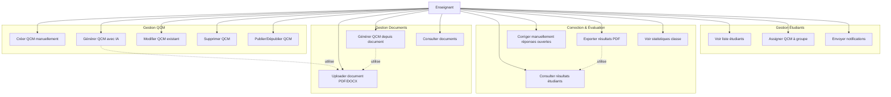

### 1.2 Cas d'Utilisation Étudiant

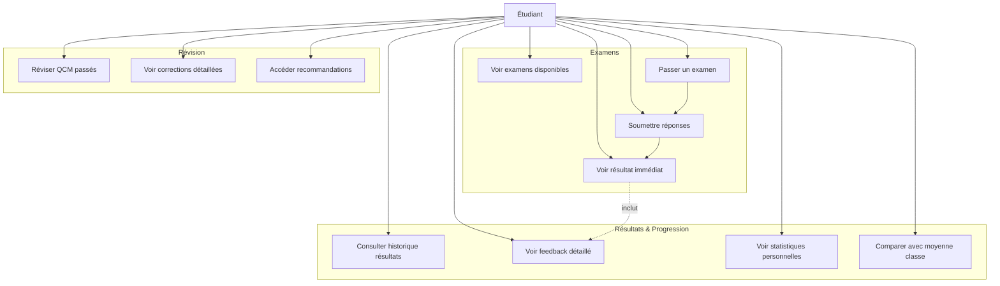

### 1.3 Cas d'Utilisation Administrateur

```mermaid
graph TB
    A[Administrateur]
    
    subgraph "Gestion Utilisateurs"
        UC1[Créer utilisateur]
        UC2[Modifier utilisateur]
        UC3[Supprimer utilisateur]
        UC4[Réinitialiser mot de passe]
        UC5[Gérer rôles/permissions]
    end
    
    subgraph "Gestion Système"
        UC6[Configurer paramètres]
        UC7[Gérer matières/niveaux]
        UC8[Voir logs système]
        UC9[Gérer backups]
    end
    
    subgraph "Statistiques Globales"
        UC10[Tableau de bord général]
        UC11[Rapports d'utilisation]
        UC12[Métriques performance]
    end
    
    A --> UC1
    A --> UC2
    A --> UC3
    A --> UC4
    A --> UC5
    A --> UC6
    A --> UC7
    A --> UC8
    A --> UC9
    A --> UC10
    A --> UC11
    A --> UC12
```

---

## 2. Diagrammes de Séquence Détaillés

### 2.1 Génération QCM avec IA (Flux Complet)

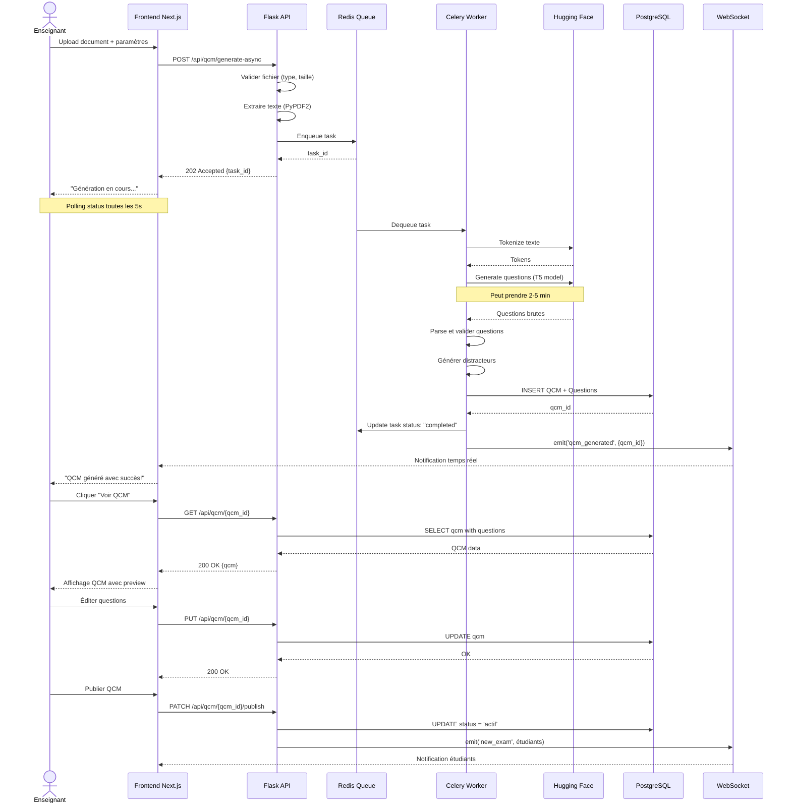

### 2.2 Passage d'Examen et Correction

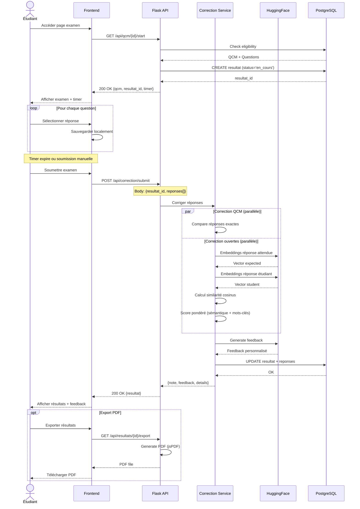

### 2.3 Authentification avec NextAuth

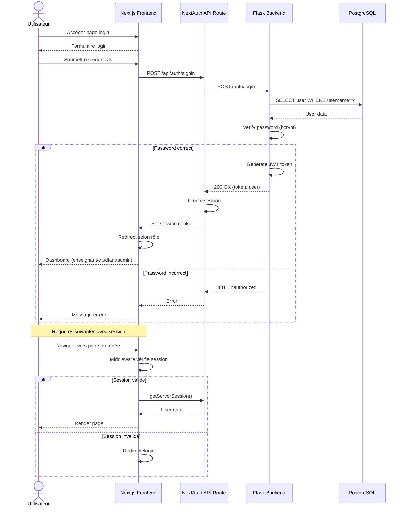

---

## 3. Diagrammes de Classes (Domain Models)

### 3.1 Modèle de Domaine Complet

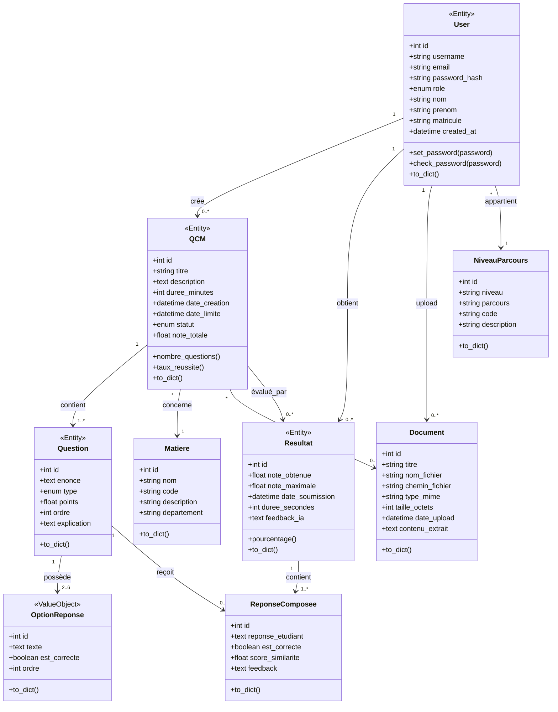

### 3.2 Architecture Services (Backend)

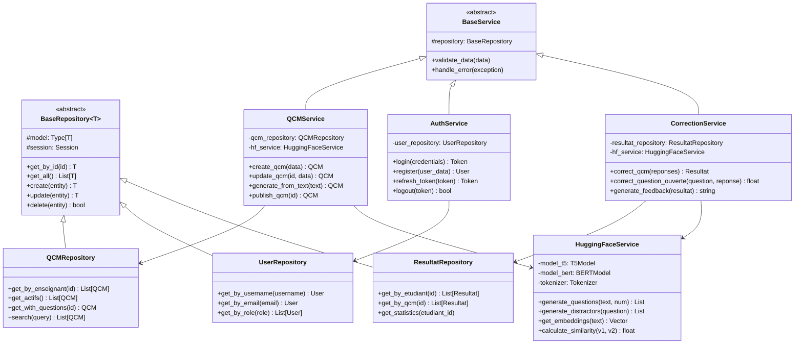

---

## 4. Diagrammes d'États

### 4.1 États d'un QCM

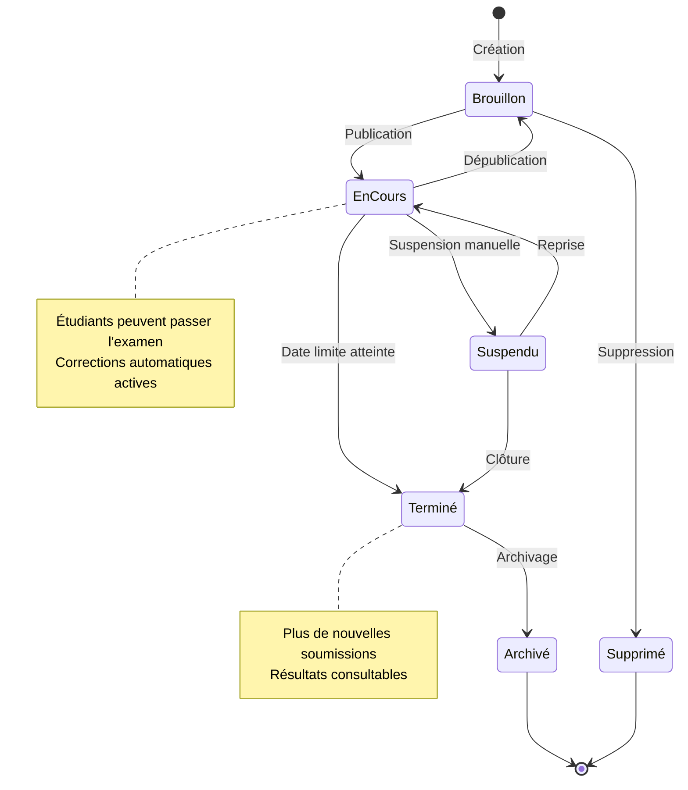

### 4.2 États d'un Résultat

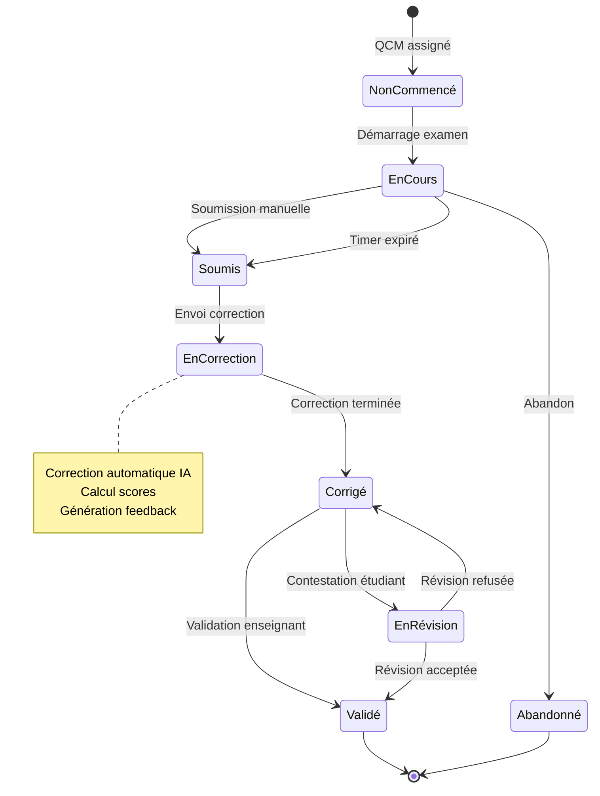

### 4.3 Workflow de Génération IA

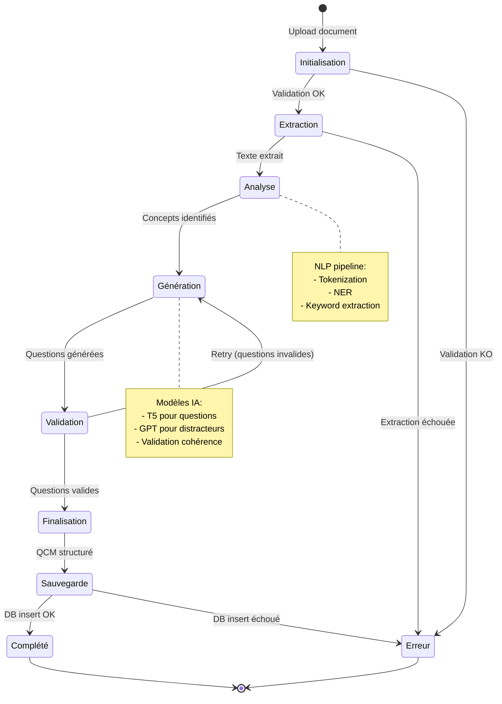

---

## 5. Diagrammes de Déploiement

### 5.1 Architecture de Déploiement AWS

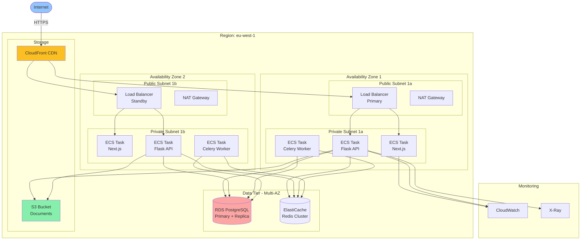

### 5.2 Docker Compose Architecture

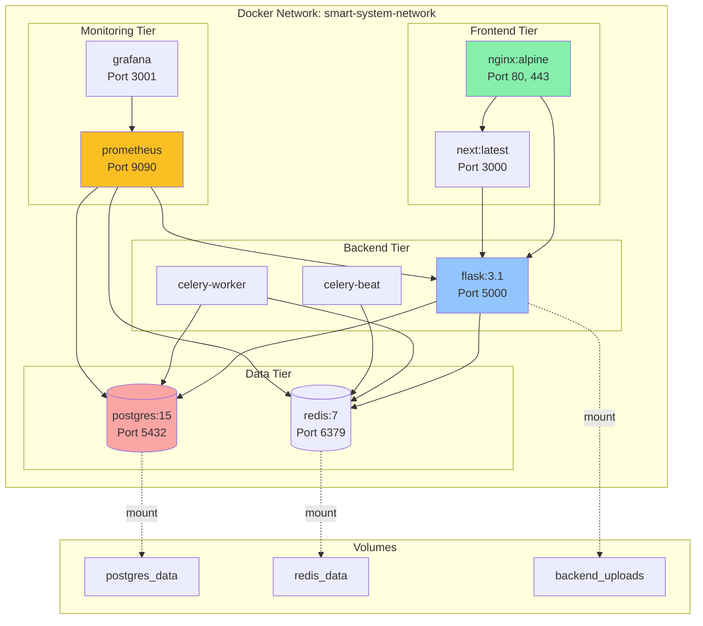

---

## 6. Diagrammes de Flux de Données

### 6.1 Data Flow - Génération QCM

```mermaid
flowchart LR
    A[Document PDF/DOCX] --> B[PyPDF2/python-docx<br/>Extraction texte]
    B --> C[Texte brut]
    
    C --> D[Preprocessing<br/>- Nettoyage<br/>- Tokenization<br/>- Segmentation]
    
    D --> E[Chunks de texte]
    
    E --> F{Type génération?}
    
    F -->|Template-based| G[Règles heuristiques]
    F -->|AI-based| H[Hugging Face T5]
    
    G --> I[Questions basiques]
    H --> J[Questions avancées]
    
    I --> K[Validation syntaxique]
    J --> K
    
    K --> L{Questions valides?}
    
    L -->|Non| M[Rejeter + retry]
    M --> F
    
    L -->|Oui| N[Génération distracteurs<br/>GPT-2]
    
    N --> O[QCM complet structuré]
    
    O --> P[(Sauvegarde PostgreSQL)]
    
    P --> Q[QCM ID retourné]
    
    style A fill:#fef3c7
    style H fill:#bfdbfe
    style N fill:#bbf7d0
    style P fill:#fca5a5
```

### 6.2 Data Flow - Correction Automatique

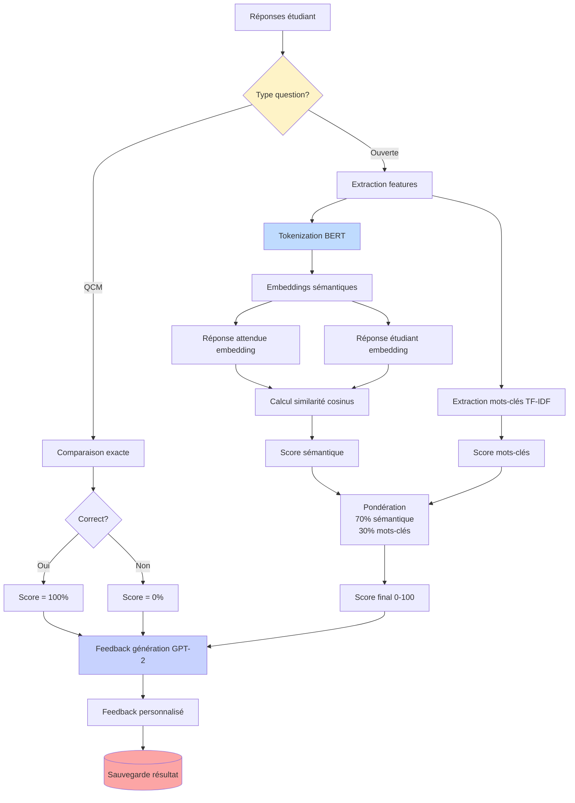

---

## 7. Diagrammes de Composants (Frontend Next.js)

### 7.1 Architecture Composants Next.js

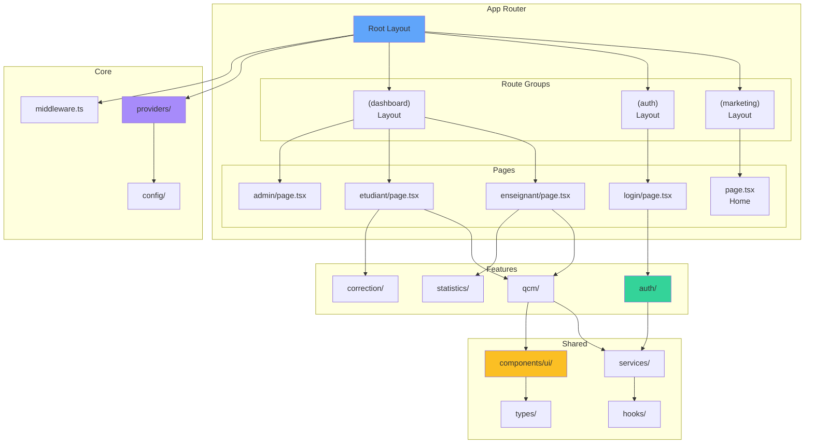

---

## 8. Diagrammes de Performance

### 8.1 Performance Optimization Pipeline

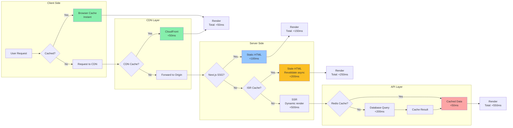

### 8.2 Scaling Strategy

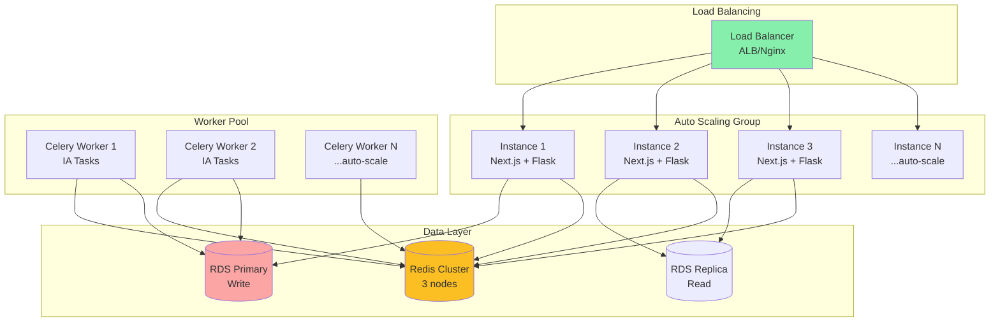

---

**📊 Fin des Diagrammes Mermaid**

Ces diagrammes couvrent tous les aspects techniques du système :
- ✅ Cas d'utilisation par rôle
- ✅ Séquences d'interactions complètes
- ✅ Architecture logicielle (classes, composants)
- ✅ États et workflows
- ✅ Déploiement et infrastructure
- ✅ Flux de données et pipelines
- ✅ Performance et scaling

Tous les diagrammes sont en format Mermaid et peuvent être intégrés directement dans la documentation Markdown.

