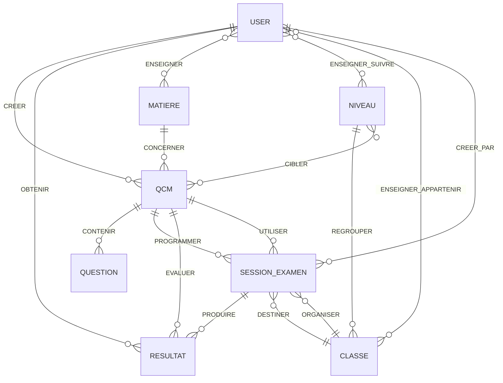

# Modélisation MERISE - Système AI-KO

## Vue d'Ensemble

Ce document présente la **modélisation MERISE complète** du système de gestion d'examens universitaires AI-KO, incluant:
- **MCD** (Modèle Conceptuel de Données)
- **MLD** (Modèle Logique de Données)
- **MPD** (Modèle Physique de Données)

---

## 📋 Table des Matières

1. [MCD - Modèle Conceptuel de Données](#mcd---modèle-conceptuel-de-données)
2. [MLD - Modèle Logique de Données](#mld---modèle-logique-de-données)
3. [MPD - Modèle Physique de Données](#mpd---modèle-physique-de-données)
4. [Dictionnaire de Données](#dictionnaire-de-données)
5. [Règles de Gestion](#règles-de-gestion)

---

## MCD - Modèle Conceptuel de Données

### Entités Principales



### Entités et Attributs

#### 1. USER (Utilisateur)
```
USER
├── id (UUID) [PK]
├── email (String) [UNIQUE]
├── name (String)
├── password_hash (String)
├── role (Enum: ADMIN, ENSEIGNANT, ETUDIANT)
├── numero_etudiant (String) [UNIQUE, NULL]
├── numero_enseignant (String) [UNIQUE, NULL]
├── telephone (String)
├── adresse (Text)
├── date_naissance (Date)
├── google_id (String) [UNIQUE, NULL]
├── avatar (String)
├── email_verified (Boolean)
├── created_at (DateTime)
└── updated_at (DateTime)
```

#### 2. NIVEAU (Niveau Universitaire)
```
NIVEAU
├── id (UUID) [PK]
├── code (String) [UNIQUE]
├── nom (String)
├── description (Text)
├── ordre (Integer)
├── cycle (String: licence, master, doctorat)
├── actif (Boolean)
├── created_at (DateTime)
└── updated_at (DateTime)
```

#### 3. MATIERE (Matière/Discipline)
```
MATIERE
├── id (UUID) [PK]
├── code (String) [UNIQUE]
├── nom (String)
├── description (Text)
├── coefficient (Float)
├── couleur (String)
├── icone (String)
├── actif (Boolean)
├── created_at (DateTime)
└── updated_at (DateTime)
```

#### 4. CLASSE (Classe/Groupe)
```
CLASSE
├── id (UUID) [PK]
├── code (String) [UNIQUE]
├── nom (String)
├── description (Text)
├── niveau_id (UUID) [FK → NIVEAU]
├── annee_scolaire (String)
├── semestre (Integer: 1 ou 2)
├── effectif_max (Integer)
├── actif (Boolean)
├── created_at (DateTime)
└── updated_at (DateTime)
```

#### 5. QCM (Questionnaire)
```
QCM
├── id (UUID) [PK]
├── titre (String)
├── description (Text)
├── duree (Integer: minutes)
├── matiere (String) [DEPRECATED]
├── matiere_id (UUID) [FK → MATIERE]
├── status (Enum: draft, published, archived)
├── difficulty_level (String: facile, moyen, difficile)
├── est_public (Boolean)
├── createur_id (UUID) [FK → USER]
├── created_at (DateTime)
└── updated_at (DateTime)
```

#### 6. QUESTION (Question)
```
QUESTION
├── id (UUID) [PK]
├── enonce (Text)
├── type_question (Enum: qcm, vrai_faux, texte_libre)
├── options (JSON)
├── reponse_correcte (Text)
├── points (Integer)
├── explication (Text)
├── qcm_id (UUID) [FK → QCM]
├── created_at (DateTime)
└── updated_at (DateTime)
```

#### 7. SESSION_EXAMEN (Session d'Examen)
```
SESSION_EXAMEN
├── id (UUID) [PK]
├── titre (String)
├── description (Text)
├── date_debut (DateTime)
├── date_fin (DateTime)
├── duree_minutes (Integer)
├── tentatives_max (Integer)
├── melange_questions (Boolean)
├── melange_options (Boolean)
├── afficher_correction (Boolean)
├── note_passage (Float)
├── status (Enum: programmee, en_cours, terminee, annulee)
├── qcm_id (UUID) [FK → QCM]
├── classe_id (UUID) [FK → CLASSE, NULL]
├── createur_id (UUID) [FK → USER]
├── created_at (DateTime)
└── updated_at (DateTime)
```

#### 8. RESULTAT (Résultat Examen)
```
RESULTAT
├── id (UUID) [PK]
├── etudiant_id (UUID) [FK → USER]
├── session_id (UUID) [FK → SESSION_EXAMEN]
├── qcm_id (UUID) [FK → QCM]
├── numero_tentative (Integer)
├── date_debut (DateTime)
├── date_fin (DateTime)
├── duree_reelle_secondes (Integer)
├── score_total (Float)
├── score_maximum (Float)
├── note_sur_20 (Float)
├── pourcentage (Float)
├── questions_total (Integer)
├── questions_repondues (Integer)
├── questions_correctes (Integer)
├── questions_incorrectes (Integer)
├── questions_partielles (Integer)
├── reponses_detail (JSON)
├── status (Enum: en_cours, termine, abandonne, invalide)
├── est_reussi (Boolean)
├── est_valide (Boolean)
├── feedback_auto (Text)
├── commentaire_prof (Text)
├── note_prof (Float)
├── created_at (DateTime)
└── updated_at (DateTime)
```

### Associations Many-to-Many

#### 1. ENSEIGNER (Professeur ↔ Matière)
```
PROFESSEUR_MATIERES
├── professeur_id (UUID) [PK, FK → USER]
├── matiere_id (UUID) [PK, FK → MATIERE]
├── annee_scolaire (String)
└── created_at (DateTime)

Cardinalités: (1,N) USER ←→ (0,N) MATIERE
```

#### 2. ENSEIGNER_NIVEAU (Professeur ↔ Niveau)
```
PROFESSEUR_NIVEAUX
├── professeur_id (UUID) [PK, FK → USER]
├── niveau_id (UUID) [PK, FK → NIVEAU]
└── created_at (DateTime)

Cardinalités: (1,N) USER ←→ (0,N) NIVEAU
```

#### 3. ENSEIGNER_CLASSE (Professeur ↔ Classe)
```
PROFESSEUR_CLASSES
├── professeur_id (UUID) [PK, FK → USER]
├── classe_id (UUID) [PK, FK → CLASSE]
├── matiere_id (UUID) [FK → MATIERE, NULL]
├── annee_scolaire (String)
└── created_at (DateTime)

Cardinalités: (1,N) USER ←→ (0,N) CLASSE
```

#### 4. INSCRIRE_NIVEAU (Étudiant ↔ Niveau)
```
ETUDIANT_NIVEAUX
├── etudiant_id (UUID) [PK, FK → USER]
├── niveau_id (UUID) [PK, FK → NIVEAU]
├── annee_scolaire (String)
├── est_actuel (Boolean)
└── created_at (DateTime)

Cardinalités: (1,N) USER ←→ (0,N) NIVEAU
```

#### 5. APPARTENIR_CLASSE (Étudiant ↔ Classe)
```
ETUDIANT_CLASSES
├── etudiant_id (UUID) [PK, FK → USER]
├── classe_id (UUID) [PK, FK → CLASSE]
├── annee_scolaire (String)
├── est_actuelle (Boolean)
└── created_at (DateTime)

Cardinalités: (1,N) USER ←→ (0,N) CLASSE
```

#### 6. CIBLER (QCM ↔ Niveau)
```
QCM_NIVEAUX
├── qcm_id (UUID) [PK, FK → QCM]
├── niveau_id (UUID) [PK, FK → NIVEAU]
└── created_at (DateTime)

Cardinalités: (0,N) QCM ←→ (0,N) NIVEAU
```

---

## MLD - Modèle Logique de Données

### Tables Principales

```
USERS (#id, email, name, password_hash, role, numero_etudiant,
       numero_enseignant, telephone, adresse, date_naissance,
       google_id, avatar, email_verified, created_at, updated_at)

NIVEAUX (#id, code, nom, description, ordre, cycle, actif,
         created_at, updated_at)

MATIERES (#id, code, nom, description, coefficient, couleur,
          icone, actif, created_at, updated_at)

CLASSES (#id, code, nom, description, #niveau_id, annee_scolaire,
         semestre, effectif_max, actif, created_at, updated_at)

QCMS (#id, titre, description, duree, matiere, #matiere_id, status,
      difficulty_level, est_public, #createur_id, created_at, updated_at)

QUESTIONS (#id, enonce, type_question, options, reponse_correcte,
           points, explication, #qcm_id, created_at, updated_at)

SESSIONS_EXAMEN (#id, titre, description, date_debut, date_fin,
                 duree_minutes, tentatives_max, melange_questions,
                 melange_options, afficher_correction, note_passage,
                 status, #qcm_id, #classe_id, #createur_id,
                 created_at, updated_at)

RESULTATS (#id, #etudiant_id, #session_id, #qcm_id, numero_tentative,
           date_debut, date_fin, duree_reelle_secondes, score_total,
           score_maximum, note_sur_20, pourcentage, questions_total,
           questions_repondues, questions_correctes, questions_incorrectes,
           questions_partielles, reponses_detail, status, est_reussi,
           est_valide, feedback_auto, commentaire_prof, note_prof,
           created_at, updated_at)
```

### Tables d'Association

```
PROFESSEUR_MATIERES (#professeur_id, #matiere_id, annee_scolaire, created_at)

PROFESSEUR_NIVEAUX (#professeur_id, #niveau_id, created_at)

PROFESSEUR_CLASSES (#professeur_id, #classe_id, #matiere_id,
                    annee_scolaire, created_at)

ETUDIANT_NIVEAUX (#etudiant_id, #niveau_id, annee_scolaire,
                  est_actuel, created_at)

ETUDIANT_CLASSES (#etudiant_id, #classe_id, annee_scolaire,
                  est_actuelle, created_at)

QCM_NIVEAUX (#qcm_id, #niveau_id, created_at)
```

### Contraintes d'Intégrité Référentielle

```sql
-- CLASSES
CLASSES.niveau_id → NIVEAUX.id (ON DELETE CASCADE)

-- QCMS
QCMS.matiere_id → MATIERES.id (ON DELETE SET NULL)
QCMS.createur_id → USERS.id (ON DELETE CASCADE)

-- QUESTIONS
QUESTIONS.qcm_id → QCMS.id (ON DELETE CASCADE)

-- SESSIONS_EXAMEN
SESSIONS_EXAMEN.qcm_id → QCMS.id (ON DELETE CASCADE)
SESSIONS_EXAMEN.classe_id → CLASSES.id (ON DELETE SET NULL)
SESSIONS_EXAMEN.createur_id → USERS.id (ON DELETE CASCADE)

-- RESULTATS
RESULTATS.etudiant_id → USERS.id (ON DELETE CASCADE)
RESULTATS.session_id → SESSIONS_EXAMEN.id (ON DELETE CASCADE)
RESULTATS.qcm_id → QCMS.id (ON DELETE CASCADE)

-- TABLES D'ASSOCIATION
PROFESSEUR_MATIERES.professeur_id → USERS.id (ON DELETE CASCADE)
PROFESSEUR_MATIERES.matiere_id → MATIERES.id (ON DELETE CASCADE)

PROFESSEUR_NIVEAUX.professeur_id → USERS.id (ON DELETE CASCADE)
PROFESSEUR_NIVEAUX.niveau_id → NIVEAUX.id (ON DELETE CASCADE)

PROFESSEUR_CLASSES.professeur_id → USERS.id (ON DELETE CASCADE)
PROFESSEUR_CLASSES.classe_id → CLASSES.id (ON DELETE CASCADE)

ETUDIANT_NIVEAUX.etudiant_id → USERS.id (ON DELETE CASCADE)
ETUDIANT_NIVEAUX.niveau_id → NIVEAUX.id (ON DELETE CASCADE)

ETUDIANT_CLASSES.etudiant_id → USERS.id (ON DELETE CASCADE)
ETUDIANT_CLASSES.classe_id → CLASSES.id (ON DELETE CASCADE)

QCM_NIVEAUX.qcm_id → QCMS.id (ON DELETE CASCADE)
QCM_NIVEAUX.niveau_id → NIVEAUX.id (ON DELETE CASCADE)
```

---

## MPD - Modèle Physique de Données

### Script de Création PostgreSQL

```sql
-- =====================================================
-- TABLES PRINCIPALES
-- =====================================================

-- Table USERS
CREATE TABLE users (
    id VARCHAR(36) PRIMARY KEY,
    email VARCHAR(255) UNIQUE NOT NULL,
    name VARCHAR(255),
    password_hash VARCHAR(255),
    role VARCHAR(20) NOT NULL DEFAULT 'etudiant',
    numero_etudiant VARCHAR(50) UNIQUE,
    numero_enseignant VARCHAR(50) UNIQUE,
    telephone VARCHAR(20),
    adresse TEXT,
    date_naissance DATE,
    google_id VARCHAR(255) UNIQUE,
    avatar VARCHAR(500),
    email_verified BOOLEAN DEFAULT FALSE NOT NULL,
    created_at TIMESTAMP DEFAULT CURRENT_TIMESTAMP NOT NULL,
    updated_at TIMESTAMP DEFAULT CURRENT_TIMESTAMP NOT NULL
);

CREATE INDEX idx_users_email ON users(email);
CREATE INDEX idx_users_numero_etudiant ON users(numero_etudiant);
CREATE INDEX idx_users_numero_enseignant ON users(numero_enseignant);
CREATE INDEX idx_users_role ON users(role);

-- Table NIVEAUX
CREATE TABLE niveaux (
    id VARCHAR(36) PRIMARY KEY,
    code VARCHAR(20) UNIQUE NOT NULL,
    nom VARCHAR(100) NOT NULL,
    description TEXT,
    ordre INTEGER NOT NULL,
    cycle VARCHAR(20) NOT NULL,
    actif BOOLEAN DEFAULT TRUE NOT NULL,
    created_at TIMESTAMP DEFAULT CURRENT_TIMESTAMP NOT NULL,
    updated_at TIMESTAMP DEFAULT CURRENT_TIMESTAMP NOT NULL
);

CREATE INDEX idx_niveaux_code ON niveaux(code);
CREATE INDEX idx_niveaux_cycle ON niveaux(cycle);

-- Table MATIERES
CREATE TABLE matieres (
    id VARCHAR(36) PRIMARY KEY,
    code VARCHAR(20) UNIQUE NOT NULL,
    nom VARCHAR(100) NOT NULL,
    description TEXT,
    coefficient DECIMAL(3,1) DEFAULT 1.0 NOT NULL,
    couleur VARCHAR(7),
    icone VARCHAR(50),
    actif BOOLEAN DEFAULT TRUE NOT NULL,
    created_at TIMESTAMP DEFAULT CURRENT_TIMESTAMP NOT NULL,
    updated_at TIMESTAMP DEFAULT CURRENT_TIMESTAMP NOT NULL
);

CREATE INDEX idx_matieres_code ON matieres(code);

-- Table CLASSES
CREATE TABLE classes (
    id VARCHAR(36) PRIMARY KEY,
    code VARCHAR(50) UNIQUE NOT NULL,
    nom VARCHAR(100) NOT NULL,
    description TEXT,
    niveau_id VARCHAR(36) NOT NULL,
    annee_scolaire VARCHAR(20) NOT NULL,
    semestre INTEGER,
    effectif_max INTEGER,
    actif BOOLEAN DEFAULT TRUE NOT NULL,
    created_at TIMESTAMP DEFAULT CURRENT_TIMESTAMP NOT NULL,
    updated_at TIMESTAMP DEFAULT CURRENT_TIMESTAMP NOT NULL,
    FOREIGN KEY (niveau_id) REFERENCES niveaux(id) ON DELETE CASCADE
);

CREATE INDEX idx_classes_code ON classes(code);
CREATE INDEX idx_classes_niveau_id ON classes(niveau_id);
CREATE INDEX idx_classes_annee_scolaire ON classes(annee_scolaire);

-- Table QCMS
CREATE TABLE qcms (
    id VARCHAR(36) PRIMARY KEY,
    titre VARCHAR(255) NOT NULL,
    description TEXT,
    duree INTEGER,
    matiere VARCHAR(100),
    matiere_id VARCHAR(36),
    status VARCHAR(20) DEFAULT 'draft' NOT NULL,
    difficulty_level VARCHAR(20),
    est_public BOOLEAN DEFAULT FALSE NOT NULL,
    createur_id VARCHAR(36) NOT NULL,
    created_at TIMESTAMP DEFAULT CURRENT_TIMESTAMP NOT NULL,
    updated_at TIMESTAMP DEFAULT CURRENT_TIMESTAMP NOT NULL,
    FOREIGN KEY (matiere_id) REFERENCES matieres(id) ON DELETE SET NULL,
    FOREIGN KEY (createur_id) REFERENCES users(id) ON DELETE CASCADE
);

CREATE INDEX idx_qcms_matiere_id ON qcms(matiere_id);
CREATE INDEX idx_qcms_createur_id ON qcms(createur_id);
CREATE INDEX idx_qcms_status ON qcms(status);

-- Table QUESTIONS
CREATE TABLE questions (
    id VARCHAR(36) PRIMARY KEY,
    enonce TEXT NOT NULL,
    type_question VARCHAR(20) DEFAULT 'qcm' NOT NULL,
    options TEXT,
    reponse_correcte TEXT,
    points INTEGER DEFAULT 1 NOT NULL,
    explication TEXT,
    qcm_id VARCHAR(36) NOT NULL,
    created_at TIMESTAMP DEFAULT CURRENT_TIMESTAMP NOT NULL,
    updated_at TIMESTAMP DEFAULT CURRENT_TIMESTAMP NOT NULL,
    FOREIGN KEY (qcm_id) REFERENCES qcms(id) ON DELETE CASCADE
);

CREATE INDEX idx_questions_qcm_id ON questions(qcm_id);

-- Table SESSIONS_EXAMEN
CREATE TABLE sessions_examen (
    id VARCHAR(36) PRIMARY KEY,
    titre VARCHAR(255) NOT NULL,
    description TEXT,
    date_debut TIMESTAMP NOT NULL,
    date_fin TIMESTAMP NOT NULL,
    duree_minutes INTEGER NOT NULL,
    tentatives_max INTEGER DEFAULT 1 NOT NULL,
    melange_questions BOOLEAN DEFAULT TRUE NOT NULL,
    melange_options BOOLEAN DEFAULT TRUE NOT NULL,
    afficher_correction BOOLEAN DEFAULT TRUE NOT NULL,
    note_passage DECIMAL(4,2) DEFAULT 10.0 NOT NULL,
    status VARCHAR(20) DEFAULT 'programmee' NOT NULL,
    qcm_id VARCHAR(36) NOT NULL,
    classe_id VARCHAR(36),
    createur_id VARCHAR(36) NOT NULL,
    created_at TIMESTAMP DEFAULT CURRENT_TIMESTAMP NOT NULL,
    updated_at TIMESTAMP DEFAULT CURRENT_TIMESTAMP NOT NULL,
    FOREIGN KEY (qcm_id) REFERENCES qcms(id) ON DELETE CASCADE,
    FOREIGN KEY (classe_id) REFERENCES classes(id) ON DELETE SET NULL,
    FOREIGN KEY (createur_id) REFERENCES users(id) ON DELETE CASCADE
);

CREATE INDEX idx_sessions_qcm_id ON sessions_examen(qcm_id);
CREATE INDEX idx_sessions_classe_id ON sessions_examen(classe_id);
CREATE INDEX idx_sessions_date_debut ON sessions_examen(date_debut);
CREATE INDEX idx_sessions_status ON sessions_examen(status);

-- Table RESULTATS
CREATE TABLE resultats (
    id VARCHAR(36) PRIMARY KEY,
    etudiant_id VARCHAR(36) NOT NULL,
    session_id VARCHAR(36) NOT NULL,
    qcm_id VARCHAR(36) NOT NULL,
    numero_tentative INTEGER DEFAULT 1 NOT NULL,
    date_debut TIMESTAMP NOT NULL,
    date_fin TIMESTAMP,
    duree_reelle_secondes INTEGER,
    score_total DECIMAL(6,2) DEFAULT 0.0 NOT NULL,
    score_maximum DECIMAL(6,2) NOT NULL,
    note_sur_20 DECIMAL(4,2),
    pourcentage DECIMAL(5,2),
    questions_total INTEGER NOT NULL,
    questions_repondues INTEGER DEFAULT 0 NOT NULL,
    questions_correctes INTEGER DEFAULT 0 NOT NULL,
    questions_incorrectes INTEGER DEFAULT 0 NOT NULL,
    questions_partielles INTEGER DEFAULT 0 NOT NULL,
    reponses_detail TEXT,
    status VARCHAR(20) DEFAULT 'en_cours' NOT NULL,
    est_reussi BOOLEAN DEFAULT FALSE NOT NULL,
    est_valide BOOLEAN DEFAULT TRUE NOT NULL,
    feedback_auto TEXT,
    commentaire_prof TEXT,
    note_prof DECIMAL(4,2),
    created_at TIMESTAMP DEFAULT CURRENT_TIMESTAMP NOT NULL,
    updated_at TIMESTAMP DEFAULT CURRENT_TIMESTAMP NOT NULL,
    FOREIGN KEY (etudiant_id) REFERENCES users(id) ON DELETE CASCADE,
    FOREIGN KEY (session_id) REFERENCES sessions_examen(id) ON DELETE CASCADE,
    FOREIGN KEY (qcm_id) REFERENCES qcms(id) ON DELETE CASCADE
);

CREATE INDEX idx_resultats_etudiant_id ON resultats(etudiant_id);
CREATE INDEX idx_resultats_session_id ON resultats(session_id);
CREATE INDEX idx_resultats_qcm_id ON resultats(qcm_id);

-- =====================================================
-- TABLES D'ASSOCIATION (MANY-TO-MANY)
-- =====================================================

-- Table PROFESSEUR_MATIERES
CREATE TABLE professeur_matieres (
    professeur_id VARCHAR(36) NOT NULL,
    matiere_id VARCHAR(36) NOT NULL,
    annee_scolaire VARCHAR(20),
    created_at TIMESTAMP DEFAULT CURRENT_TIMESTAMP,
    PRIMARY KEY (professeur_id, matiere_id),
    FOREIGN KEY (professeur_id) REFERENCES users(id) ON DELETE CASCADE,
    FOREIGN KEY (matiere_id) REFERENCES matieres(id) ON DELETE CASCADE
);

-- Table PROFESSEUR_NIVEAUX
CREATE TABLE professeur_niveaux (
    professeur_id VARCHAR(36) NOT NULL,
    niveau_id VARCHAR(36) NOT NULL,
    created_at TIMESTAMP DEFAULT CURRENT_TIMESTAMP,
    PRIMARY KEY (professeur_id, niveau_id),
    FOREIGN KEY (professeur_id) REFERENCES users(id) ON DELETE CASCADE,
    FOREIGN KEY (niveau_id) REFERENCES niveaux(id) ON DELETE CASCADE
);

-- Table PROFESSEUR_CLASSES
CREATE TABLE professeur_classes (
    professeur_id VARCHAR(36) NOT NULL,
    classe_id VARCHAR(36) NOT NULL,
    matiere_id VARCHAR(36),
    annee_scolaire VARCHAR(20) NOT NULL,
    created_at TIMESTAMP DEFAULT CURRENT_TIMESTAMP,
    PRIMARY KEY (professeur_id, classe_id),
    FOREIGN KEY (professeur_id) REFERENCES users(id) ON DELETE CASCADE,
    FOREIGN KEY (classe_id) REFERENCES classes(id) ON DELETE CASCADE,
    FOREIGN KEY (matiere_id) REFERENCES matieres(id) ON DELETE SET NULL
);

-- Table ETUDIANT_NIVEAUX
CREATE TABLE etudiant_niveaux (
    etudiant_id VARCHAR(36) NOT NULL,
    niveau_id VARCHAR(36) NOT NULL,
    annee_scolaire VARCHAR(20) NOT NULL,
    est_actuel BOOLEAN DEFAULT TRUE,
    created_at TIMESTAMP DEFAULT CURRENT_TIMESTAMP,
    PRIMARY KEY (etudiant_id, niveau_id),
    FOREIGN KEY (etudiant_id) REFERENCES users(id) ON DELETE CASCADE,
    FOREIGN KEY (niveau_id) REFERENCES niveaux(id) ON DELETE CASCADE
);

-- Table ETUDIANT_CLASSES
CREATE TABLE etudiant_classes (
    etudiant_id VARCHAR(36) NOT NULL,
    classe_id VARCHAR(36) NOT NULL,
    annee_scolaire VARCHAR(20) NOT NULL,
    est_actuelle BOOLEAN DEFAULT TRUE,
    created_at TIMESTAMP DEFAULT CURRENT_TIMESTAMP,
    PRIMARY KEY (etudiant_id, classe_id),
    FOREIGN KEY (etudiant_id) REFERENCES users(id) ON DELETE CASCADE,
    FOREIGN KEY (classe_id) REFERENCES classes(id) ON DELETE CASCADE
);

-- Table QCM_NIVEAUX
CREATE TABLE qcm_niveaux (
    qcm_id VARCHAR(36) NOT NULL,
    niveau_id VARCHAR(36) NOT NULL,
    created_at TIMESTAMP DEFAULT CURRENT_TIMESTAMP,
    PRIMARY KEY (qcm_id, niveau_id),
    FOREIGN KEY (qcm_id) REFERENCES qcms(id) ON DELETE CASCADE,
    FOREIGN KEY (niveau_id) REFERENCES niveaux(id) ON DELETE CASCADE
);
```

---

## Dictionnaire de Données

### Table USERS

| Attribut | Type | Taille | Contrainte | Description |
|----------|------|--------|------------|-------------|
| id | UUID | 36 | PK | Identifiant unique |
| email | VARCHAR | 255 | UNIQUE, NOT NULL | Email de connexion |
| name | VARCHAR | 255 | | Nom complet |
| password_hash | VARCHAR | 255 | | Hash bcrypt du mot de passe |
| role | VARCHAR | 20 | NOT NULL | admin, enseignant, etudiant |
| numero_etudiant | VARCHAR | 50 | UNIQUE | Numéro d'étudiant |
| numero_enseignant | VARCHAR | 50 | UNIQUE | Numéro d'enseignant |
| telephone | VARCHAR | 20 | | Numéro de téléphone |
| adresse | TEXT | | | Adresse postale |
| date_naissance | DATE | | | Date de naissance |
| google_id | VARCHAR | 255 | UNIQUE | ID Google OAuth |
| avatar | VARCHAR | 500 | | URL de l'avatar |
| email_verified | BOOLEAN | | NOT NULL | Email vérifié |
| created_at | TIMESTAMP | | NOT NULL | Date de création |
| updated_at | TIMESTAMP | | NOT NULL | Date de modification |

### Table NIVEAUX

| Attribut | Type | Taille | Contrainte | Description |
|----------|------|--------|------------|-------------|
| id | UUID | 36 | PK | Identifiant unique |
| code | VARCHAR | 20 | UNIQUE, NOT NULL | Code niveau (L1, M2) |
| nom | VARCHAR | 100 | NOT NULL | Nom complet |
| description | TEXT | | | Description |
| ordre | INTEGER | | NOT NULL | Ordre de tri (1, 2, 3...) |
| cycle | VARCHAR | 20 | NOT NULL | licence, master, doctorat |
| actif | BOOLEAN | | NOT NULL | Niveau actif |

### Table RESULTATS (Attributs Principaux)

| Attribut | Type | Contrainte | Description |
|----------|------|------------|-------------|
| score_total | DECIMAL(6,2) | NOT NULL | Points obtenus |
| score_maximum | DECIMAL(6,2) | NOT NULL | Points maximum |
| note_sur_20 | DECIMAL(4,2) | | Note sur 20 |
| pourcentage | DECIMAL(5,2) | | Pourcentage (0-100) |
| est_reussi | BOOLEAN | NOT NULL | Note >= note_passage |
| est_valide | BOOLEAN | NOT NULL | Résultat valide (pas de triche) |
| feedback_auto | TEXT | | Feedback généré par IA |
| commentaire_prof | TEXT | | Commentaire du professeur |

---

## Règles de Gestion

### RG01 - Utilisateurs

1. Un utilisateur possède **un seul rôle** (ADMIN, ENSEIGNANT, ETUDIANT)
2. L'email est **unique** dans le système
3. Un étudiant possède un **numero_etudiant unique**
4. Un enseignant possède un **numero_enseignant unique**
5. Un utilisateur peut se connecter via **email/password OU Google OAuth**

### RG02 - Professeurs et Matières

1. Un professeur peut enseigner **plusieurs matières** (0,N)
2. Une matière peut être enseignée par **plusieurs professeurs** (0,N)
3. L'affectation est **tracée par année scolaire**

### RG03 - Professeurs et Niveaux

1. Un professeur peut enseigner à **plusieurs niveaux** (0,N)
2. Un niveau peut avoir **plusieurs professeurs** (0,N)

### RG04 - Professeurs et Classes

1. Un professeur peut enseigner à **plusieurs classes** (0,N)
2. Une classe peut avoir **plusieurs professeurs** (0,N)
3. L'affectation précise la **matière enseignée** (optionnel)
4. L'affectation est **tracée par année scolaire**

### RG05 - Étudiants et Niveaux

1. Un étudiant peut être inscrit à **plusieurs niveaux** dans le temps (historique)
2. Un niveau peut avoir **plusieurs étudiants** (0,N)
3. Un seul niveau est marqué comme **"actuel"** par année scolaire
4. Permet le suivi du **redoublement** et des **changements de niveau**

### RG06 - Étudiants et Classes

1. Un étudiant peut appartenir à **plusieurs classes** (0,N)
2. Une classe peut avoir **plusieurs étudiants** (0,N)
3. Une seule classe est marquée comme **"actuelle"** par année scolaire

### RG07 - Classes et Niveaux

1. Une classe appartient à **un seul niveau** (1,1)
2. Un niveau peut regrouper **plusieurs classes** (0,N)
3. Exemple: L1-INFO-A et L1-INFO-B appartiennent au niveau L1

### RG08 - QCM et Matières

1. Un QCM concerne **une seule matière** (0,1)
2. Une matière peut avoir **plusieurs QCM** (0,N)
3. Le champ `qcm.matiere` (texte) est **deprecated** au profit de `matiere_id`

### RG09 - QCM et Niveaux

1. Un QCM peut cibler **plusieurs niveaux** (0,N)
2. Un niveau peut être ciblé par **plusieurs QCM** (0,N)
3. Permet un QCM pour "L1 ET L2" simultanément

### RG10 - QCM et Questions

1. Un QCM contient **plusieurs questions** (1,N)
2. Une question appartient à **un seul QCM** (1,1)
3. **CASCADE DELETE**: supprimer un QCM supprime ses questions

### RG11 - Sessions d'Examen

1. Une session est basée sur **un seul QCM** (1,1)
2. Une session est destinée à **une classe** (0,1) ou ouverte à tous
3. Une session est créée par **un seul professeur** (1,1)
4. Une session a un **statut**: programmee, en_cours, terminee, annulee
5. Les **tentatives** sont limitées par `tentatives_max`

### RG12 - Résultats

1. Un résultat est lié à **un étudiant** (1,1)
2. Un résultat est lié à **une session** (1,1)
3. Un résultat est lié au **QCM de la session** (1,1)
4. Un étudiant peut avoir **plusieurs tentatives** (numérotées)
5. Le résultat est **valide** si `est_valide = TRUE` (détection de triche)
6. Le résultat est **réussi** si `note_sur_20 >= session.note_passage`

### RG13 - Scoring et Feedback

1. `score_total` = somme des points obtenus
2. `score_maximum` = somme des points possibles
3. `pourcentage` = (score_total / score_maximum) × 100
4. `note_sur_20` = (score_total / score_maximum) × 20
5. `feedback_auto` est généré par l'IA
6. `commentaire_prof` peut être ajouté manuellement
7. `note_prof` peut **ajuster** la note automatique

### RG14 - Visibilité et Statuts

1. Un QCM peut être **public** (`est_public = TRUE`) ou privé
2. Seuls les QCM **published** sont visibles des étudiants
3. Les QCM **draft** sont en cours de rédaction
4. Les QCM **archived** sont archivés

---

## Notes de Conception

### Choix Techniques

1. **UUIDs** pour toutes les clés primaires (portabilité, sécurité)
2. **Timestamps** automatiques (created_at, updated_at)
3. **Soft Delete** possible via champ `actif` pour Niveaux et Matières
4. **JSON** pour stockage flexible (options, reponses_detail)
5. **Index** sur toutes les clés étrangères et champs fréquemment recherchés

### Performance

1. **Lazy Loading** pour les relations many-to-many (SQLAlchemy)
2. **Index composites** possibles pour requêtes complexes
3. **Partitioning** possible sur table RESULTATS (par année scolaire)

### Évolutions Futures

1. Ajout table **ETABLISSEMENTS** pour multi-établissements
2. Ajout table **GROUPES_TD** pour travaux dirigés
3. Ajout table **PROJETS** pour projets étudiants
4. Ajout table **BADGES** pour certifications

---

**Version:** 1.0
**Date:** Janvier 2025
**Auteur:** Équipe AI-KO
