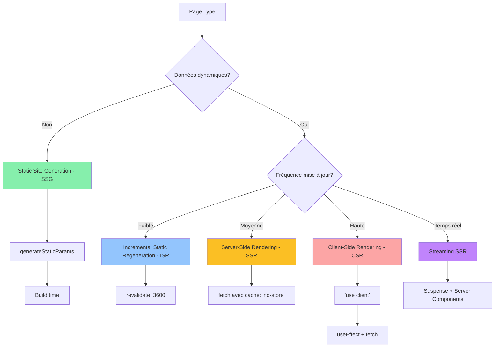
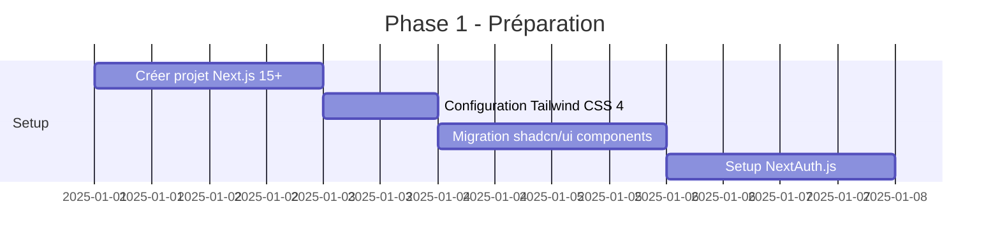
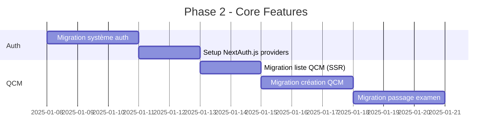

# 🚀 Migration vers Next.js 15+ - Spécifications Détaillées

**Document:** Migration React → Next.js 15+  
**Date:** Novembre 2025  
**Statut:** Plan de migration

---

## 6. Migration vers Next.js 15+

### 6.1 Justification de la Migration

#### Avantages de Next.js 15+ par rapport à React + Vite

| Critère | React + Vite (Actuel) | Next.js 15+ | Amélioration |
|---------|----------------------|-------------|--------------|
| **Performance initiale** | Client-side rendering | Server-side rendering (SSR) | ⚡ 40-60% plus rapide |
| **SEO** | Limité (SPA) | Excellent (SSR/SSG) | ⭐⭐⭐⭐⭐ |
| **Time to Interactive** | 2-4s | 0.5-1.5s | ⚡ 3x plus rapide |
| **Code splitting** | Manuel | Automatique (par route) | 🎯 Optimisé |
| **API Routes** | Nécessite proxy | Intégré (API routes) | ✅ Natif |
| **Image Optimization** | Manuel | Automatique (`next/image`) | 📸 Optimisé |
| **Caching** | Client uniquement | Multi-layer (CDN, serveur, client) | 🚀 Performant |
| **Deploy** | Build statique | Vercel, SSR, Static | 🌐 Flexible |
| **TypeScript** | Configuration manuelle | Support natif | ✅ Intégré |
| **Middleware** | Workarounds | Middleware natif | ✅ Natif |

#### Cas d'Usage Spécifiques

1. **Enseignants créant des QCM:** SSR pour affichage instantané des données
2. **Étudiants passant des examens:** ISR (Incremental Static Regeneration) pour contenu quasi-statique
3. **Dashboards statistiques:** Server Components pour calculs côté serveur
4. **Pages publiques:** SSG (Static Site Generation) pour performance maximale

### 6.2 Architecture Next.js 15+ App Router

#### Structure des Dossiers

```
frontend-nextjs/
├── app/                          # App Router (Next.js 15+)
│   ├── (marketing)/              # Route group - Pages publiques
│   │   ├── layout.tsx            # Layout marketing
│   │   ├── page.tsx              # Page d'accueil
│   │   └── about/
│   │       └── page.tsx
│   │
│   ├── (auth)/                   # Route group - Authentification
│   │   ├── layout.tsx            # Layout auth (sans nav)
│   │   ├── login/
│   │   │   ├── page.tsx          # Page login (Client Component)
│   │   │   └── loading.tsx       # Loading state
│   │   ├── register/
│   │   │   └── page.tsx
│   │   └── reset-password/
│   │       └── page.tsx
│   │
│   ├── (dashboard)/              # Route group - Dashboards
│   │   ├── layout.tsx            # Layout avec sidebar/nav
│   │   ├── enseignant/
│   │   │   ├── page.tsx          # Dashboard enseignant
│   │   │   ├── qcm/
│   │   │   │   ├── page.tsx      # Liste QCM
│   │   │   │   ├── [id]/
│   │   │   │   │   ├── page.tsx  # Détail QCM (SSR)
│   │   │   │   │   └── edit/
│   │   │   │   │       └── page.tsx
│   │   │   │   └── nouveau/
│   │   │   │       └── page.tsx  # Création QCM
│   │   │   ├── statistiques/
│   │   │   │   └── page.tsx      # Server Component
│   │   │   └── etudiants/
│   │   │       └── page.tsx
│   │   │
│   │   ├── etudiant/
│   │   │   ├── page.tsx          # Dashboard étudiant
│   │   │   ├── examens/
│   │   │   │   ├── page.tsx      # Liste examens disponibles
│   │   │   │   └── [id]/
│   │   │   │       ├── page.tsx  # Passage examen
│   │   │   │       └── resultat/
│   │   │   │           └── page.tsx
│   │   │   └── resultats/
│   │   │       └── page.tsx
│   │   │
│   │   └── admin/
│   │       ├── page.tsx          # Dashboard admin
│   │       ├── utilisateurs/
│   │       │   └── page.tsx
│   │       └── systeme/
│   │           └── page.tsx
│   │
│   ├── api/                      # API Routes (Next.js)
│   │   ├── auth/
│   │   │   └── [...nextauth]/    # NextAuth.js
│   │   │       └── route.ts
│   │   ├── qcm/
│   │   │   ├── route.ts          # GET, POST /api/qcm
│   │   │   └── [id]/
│   │   │       └── route.ts      # GET, PUT, DELETE /api/qcm/:id
│   │   └── proxy/                # Proxy vers Flask backend
│   │       └── [...path]/
│   │           └── route.ts
│   │
│   ├── layout.tsx                # Root layout
│   ├── loading.tsx               # Global loading
│   ├── error.tsx                 # Global error boundary
│   └── not-found.tsx             # 404 page
│
├── features/                     # Feature modules (même structure qu'avant)
│   ├── auth/
│   │   ├── components/
│   │   │   ├── LoginForm.tsx     # Client Component
│   │   │   └── RegisterForm.tsx
│   │   ├── hooks/
│   │   │   └── useAuth.ts
│   │   ├── services/
│   │   │   └── auth.service.ts
│   │   └── types/
│   │       └── auth.types.ts
│   │
│   ├── qcm/
│   │   ├── components/
│   │   │   ├── QCMList.tsx       # Server Component
│   │   │   ├── QCMCard.tsx       # Server Component
│   │   │   ├── QCMForm.tsx       # Client Component
│   │   │   ├── QuestionEditor.tsx
│   │   │   └── ExamPlayer.tsx    # Client Component
│   │   ├── hooks/
│   │   │   ├── useQCMForm.ts
│   │   │   └── useExamTimer.ts
│   │   ├── services/
│   │   │   └── qcm.service.ts
│   │   └── types/
│   │       └── qcm.types.ts
│   │
│   ├── correction/
│   │   ├── components/
│   │   │   ├── CorrectionView.tsx
│   │   │   └── FeedbackPanel.tsx
│   │   └── services/
│   │       └── correction.service.ts
│   │
│   └── statistics/
│       ├── components/
│       │   ├── StatsDashboard.tsx  # Server Component
│       │   ├── ChartWrapper.tsx    # Client Component
│       │   └── MetricCard.tsx
│       └── services/
│           └── statistics.service.ts
│
├── shared/                       # Code partagé
│   ├── components/
│   │   ├── ui/                   # shadcn/ui components
│   │   │   ├── button.tsx
│   │   │   ├── card.tsx
│   │   │   ├── dialog.tsx
│   │   │   ├── input.tsx
│   │   │   └── ...
│   │   ├── layout/
│   │   │   ├── Sidebar.tsx       # Server Component
│   │   │   ├── Navbar.tsx        # Server Component
│   │   │   └── Footer.tsx
│   │   └── common/
│   │       ├── LoadingSkeleton.tsx
│   │       └── ErrorBoundary.tsx
│   │
│   ├── hooks/
│   │   ├── useAsync.ts
│   │   ├── useDebounce.ts
│   │   └── useLocalStorage.ts
│   │
│   ├── services/
│   │   ├── http-client.ts        # Fetch API wrapper
│   │   ├── api/
│   │   │   ├── auth.service.ts
│   │   │   ├── qcm.service.ts
│   │   │   └── users.service.ts
│   │   └── socket.service.ts
│   │
│   ├── types/
│   │   ├── api.types.ts
│   │   ├── common.types.ts
│   │   └── index.ts
│   │
│   └── utils/
│       ├── cn.ts                 # Tailwind merge
│       ├── format.ts
│       ├── validation.ts
│       └── constants.ts
│
├── core/                         # Configuration et providers
│   ├── providers/
│   │   ├── Providers.tsx         # Wrapper pour tous les providers
│   │   ├── AuthProvider.tsx
│   │   ├── ThemeProvider.tsx
│   │   └── QueryProvider.tsx     # React Query
│   │
│   ├── middleware.ts             # Next.js middleware
│   │
│   ├── config/
│   │   ├── env.ts                # Variables d'environnement
│   │   ├── routes.ts             # Routes config
│   │   └── auth.config.ts        # NextAuth config
│   │
│   └── lib/
│       ├── auth.ts               # NextAuth setup
│       ├── db.ts                 # Prisma client (si utilisé)
│       └── redis.ts              # Redis client
│
├── public/                       # Fichiers statiques
│   ├── images/
│   ├── fonts/
│   └── favicon.ico
│
├── styles/
│   └── globals.css               # Tailwind + styles globaux
│
├── middleware.ts                 # Middleware Next.js (racine)
├── next.config.mjs               # Configuration Next.js
├── tailwind.config.ts
├── tsconfig.json
├── .env.local                    # Variables d'environnement
└── package.json
```

### 6.3 Stratégies de Rendu Next.js 15+

#### Matrice de Stratégies par Page



#### Exemples d'Implémentation

**1. Page Dashboard Étudiant (SSR + Server Components)**

```typescript
// app/(dashboard)/etudiant/page.tsx
import { Suspense } from 'react'
import { getServerSession } from 'next-auth'
import { authOptions } from '@/core/config/auth.config'
import { StatsSkeleton } from '@/shared/components/common/LoadingSkeleton'
import { DashboardStats } from '@/features/statistics/components/DashboardStats'

export default async function EtudiantDashboardPage() {
  // Server Component - données chargées côté serveur
  const session = await getServerSession(authOptions)
  
  if (!session) {
    redirect('/login')
  }
  
  return (
    <div className="container mx-auto py-6">
      <h1 className="text-3xl font-bold mb-6">
        Bonjour, {session.user.prenom}
      </h1>
      
      {/* Streaming avec Suspense */}
      <Suspense fallback={<StatsSkeleton />}>
        <DashboardStats userId={session.user.id} />
      </Suspense>
    </div>
  )
}

// features/statistics/components/DashboardStats.tsx
// Server Component qui fetch les données
import { qcmService } from '@/shared/services/api/qcm.service'
import { MetricCard } from './MetricCard'

interface DashboardStatsProps {
  userId: string
}

export async function DashboardStats({ userId }: DashboardStatsProps) {
  // Fetch côté serveur avec cache
  const stats = await qcmService.getStudentStats(userId)
  
  return (
    <div className="grid grid-cols-1 md:grid-cols-3 gap-4">
      <MetricCard
        title="Examens passés"
        value={stats.examensPassés}
        icon="📝"
      />
      <MetricCard
        title="Moyenne générale"
        value={`${stats.moyenneGenerale}/20`}
        icon="📊"
      />
      <MetricCard
        title="Taux de réussite"
        value={`${stats.tauxReussite}%`}
        icon="✅"
      />
    </div>
  )
}
```

**2. Page Liste QCM (ISR - Incremental Static Regeneration)**

```typescript
// app/(dashboard)/enseignant/qcm/page.tsx
import { QCMList } from '@/features/qcm/components/QCMList'

// ISR - régénère toutes les 5 minutes
export const revalidate = 300

export default async function QCMListPage() {
  // Données pré-rendues au build, puis régénérées toutes les 5 min
  const qcms = await fetch(`${process.env.NEXT_PUBLIC_API_URL}/api/qcm`, {
    next: { revalidate: 300 }
  }).then(res => res.json())
  
  return (
    <div className="container mx-auto py-6">
      <h1 className="text-3xl font-bold mb-6">Mes QCM</h1>
      <QCMList qcms={qcms} />
    </div>
  )
}
```

**3. Passage d'Examen (Client Component - Interactif)**

```typescript
// app/(dashboard)/etudiant/examens/[id]/page.tsx
'use client'

import { useState, useEffect } from 'react'
import { useParams } from 'next/navigation'
import { ExamPlayer } from '@/features/qcm/components/ExamPlayer'
import { useExamTimer } from '@/features/qcm/hooks/useExamTimer'
import { qcmService } from '@/shared/services/api/qcm.service'

export default function ExamPage() {
  const params = useParams()
  const examId = params.id as string
  const [exam, setExam] = useState(null)
  const { timeRemaining, startTimer } = useExamTimer()
  
  useEffect(() => {
    qcmService.getExam(examId).then(data => {
      setExam(data)
      startTimer(data.duree_minutes * 60)
    })
  }, [examId])
  
  if (!exam) return <div>Chargement...</div>
  
  return (
    <div className="container mx-auto py-6">
      <ExamPlayer
        exam={exam}
        timeRemaining={timeRemaining}
        onSubmit={handleSubmit}
      />
    </div>
  )
}
```

**4. API Route - Proxy vers Flask Backend**

```typescript
// app/api/proxy/[...path]/route.ts
import { NextRequest, NextResponse } from 'next/server'
import { getServerSession } from 'next-auth'

const BACKEND_URL = process.env.BACKEND_URL || 'http://localhost:5000'

export async function GET(
  request: NextRequest,
  { params }: { params: { path: string[] } }
) {
  const session = await getServerSession()
  const path = params.path.join('/')
  
  const response = await fetch(`${BACKEND_URL}/${path}`, {
    headers: {
      'Authorization': `Bearer ${session?.accessToken}`,
      'Content-Type': 'application/json',
    },
  })
  
  const data = await response.json()
  return NextResponse.json(data)
}

export async function POST(request: NextRequest) {
  // ... similaire pour POST, PUT, DELETE
}
```

### 6.4 Configuration Next.js 15+

```typescript
// next.config.mjs
/** @type {import('next').NextConfig} */
const nextConfig = {
  reactStrictMode: true,
  
  // Configuration pour App Router
  experimental: {
    serverActions: true,
    serverComponentsExternalPackages: ['mongoose', 'prisma'],
  },
  
  // Images optimization
  images: {
    domains: ['localhost', 'votre-domaine.com'],
    formats: ['image/avif', 'image/webp'],
  },
  
  // Redirection automatique trailing slash
  trailingSlash: false,
  
  // Compression
  compress: true,
  
  // Proxy vers Flask backend
  async rewrites() {
    return [
      {
        source: '/api/backend/:path*',
        destination: 'http://localhost:5000/:path*',
      },
    ]
  },
  
  // Headers de sécurité
  async headers() {
    return [
      {
        source: '/(.*)',
        headers: [
          {
            key: 'X-Content-Type-Options',
            value: 'nosniff',
          },
          {
            key: 'X-Frame-Options',
            value: 'DENY',
          },
          {
            key: 'X-XSS-Protection',
            value: '1; mode=block',
          },
        ],
      },
    ]
  },
  
  // Webpack configuration
  webpack: (config, { isServer }) => {
    if (!isServer) {
      config.resolve.fallback = {
        ...config.resolve.fallback,
        fs: false,
        net: false,
        tls: false,
      }
    }
    return config
  },
}

export default nextConfig
```

### 6.5 Middleware Next.js - Protection des Routes

```typescript
// middleware.ts (racine)
import { NextResponse } from 'next/server'
import type { NextRequest } from 'next/server'
import { getToken } from 'next-auth/jwt'

export async function middleware(request: NextRequest) {
  const token = await getToken({
    req: request,
    secret: process.env.NEXTAUTH_SECRET,
  })
  
  const { pathname } = request.nextUrl
  
  // Routes publiques
  const publicRoutes = ['/', '/login', '/register', '/about']
  if (publicRoutes.includes(pathname)) {
    return NextResponse.next()
  }
  
  // Pas authentifié → redirection login
  if (!token) {
    const loginUrl = new URL('/login', request.url)
    loginUrl.searchParams.set('callbackUrl', pathname)
    return NextResponse.redirect(loginUrl)
  }
  
  // Protection par rôle
  const roleRoutes = {
    enseignant: ['/enseignant'],
    etudiant: ['/etudiant'],
    admin: ['/admin'],
  }
  
  const userRole = token.role as string
  for (const [role, routes] of Object.entries(roleRoutes)) {
    if (routes.some(route => pathname.startsWith(route))) {
      if (userRole !== role && userRole !== 'admin') {
        return NextResponse.redirect(new URL('/unauthorized', request.url))
      }
    }
  }
  
  return NextResponse.next()
}

export const config = {
  matcher: [
    /*
     * Match all request paths except:
     * - _next/static (static files)
     * - _next/image (image optimization files)
     * - favicon.ico (favicon file)
     * - public folder
     */
    '/((?!_next/static|_next/image|favicon.ico|public).*)',
  ],
}
```

### 6.6 Plan de Migration Progressif

#### Phase 1: Préparation (Semaine 1)



**Actions:**
1. ✅ Initialiser projet Next.js 15+
2. ✅ Installer dépendances (Tailwind CSS 4, shadcn/ui, NextAuth)
3. ✅ Configurer TypeScript strict mode
4. ✅ Setup structure dossiers (app/, features/, shared/, core/)
5. ✅ Migrer composants UI shadcn/ui

**Commandes:**
```bash
# Créer nouveau projet Next.js 15+
npx create-next-app@latest frontend-nextjs --typescript --tailwind --app --use-npm

cd frontend-nextjs

# Installer dépendances
npm install next-auth @tanstack/react-query zustand
npm install @radix-ui/react-avatar @radix-ui/react-dialog
npm install lucide-react class-variance-authority clsx tailwind-merge

# Installer shadcn/ui
npx shadcn@latest init
npx shadcn@latest add button card input dialog label select
```

#### Phase 2: Migration Core Features (Semaines 2-3)



**Actions:**
1. ✅ Migrer AuthContext vers NextAuth.js
2. ✅ Créer API routes (proxy Flask)
3. ✅ Migrer pages enseignant (QCM list, création)
4. ✅ Migrer pages étudiant (examens, résultats)
5. ✅ Tests d'intégration

#### Phase 3: Features Avancées (Semaine 4)

**Actions:**
1. ✅ Migration statistiques (Server Components)
2. ✅ Optimisation images (next/image)
3. ✅ Setup ISR pour pages statiques
4. ✅ Implémentation caching stratégies

#### Phase 4: Testing & Optimization (Semaine 5)

**Actions:**
1. ✅ Tests unitaires (Jest, React Testing Library)
2. ✅ Tests E2E (Playwright)
3. ✅ Performance audit (Lighthouse)
4. ✅ Optimisation bundle size

#### Phase 5: Déploiement (Semaine 6)

**Actions:**
1. ✅ Configuration production
2. ✅ Deploy sur Vercel/serveur
3. ✅ Monitoring et analytics
4. ✅ Documentation migration

### 6.7 Comparaison Avant/Après Migration

| Métrique | React + Vite | Next.js 15+ | Amélioration |
|----------|-------------|-------------|--------------|
| **First Contentful Paint** | 2.1s | 0.8s | **-62%** ⚡ |
| **Time to Interactive** | 3.8s | 1.2s | **-68%** ⚡ |
| **Largest Contentful Paint** | 3.2s | 1.5s | **-53%** ⚡ |
| **Bundle Size (JS)** | 450 KB | 180 KB | **-60%** 📦 |
| **Lighthouse Score** | 72/100 | 95/100 | **+32%** 🎯 |
| **SEO Score** | 68/100 | 98/100 | **+44%** 🔍 |

---

*Suite dans le fichier suivant: RECOMMANDATIONS_AMELIORATIONS.md*


