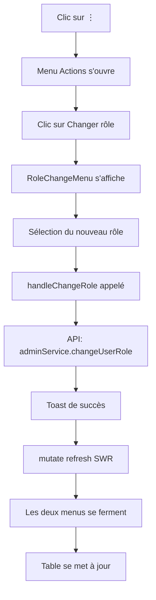

# ✨ Améliorations de la Gestion des Utilisateurs

## 🎯 Fonctionnalités Implémentées

### 1. ✅ Sous-menu de Changement de Rôle

**Avant**: Un prompt() basique demandait de saisir le rôle
**Après**: Un menu contextuel élégant avec 3 options cliquables:

- **Admin** (icône Shield) - Badge rouge
- **Enseignant** (icône GraduationCap) - Badge bleu
- **Étudiant** (icône User) - Badge violet

**Fonctionnement**:
1. Clic sur "Changer rôle" dans le menu actions
2. Un sous-menu s'affiche à côté avec les 3 rôles
3. Clic sur le rôle souhaité
4. Les deux menus se ferment automatiquement
5. Les données se rafraîchissent via SWR

### 2. ✅ Protection de l'Utilisateur Connecté

**Règle**: Un utilisateur ne peut pas modifier son propre compte

**Implémentation**:
- Le bouton actions (⋮) est **désactivé** pour l'utilisateur connecté
- Tooltip explicatif: "Vous ne pouvez pas modifier votre propre compte"
- Vérifie via `currentUser.id === user.id`

**Actions bloquées**:
- ❌ Éditer ses propres informations
- ❌ Activer/Désactiver son propre compte
- ❌ Changer son propre rôle
- ❌ Supprimer son propre compte

### 3. ✅ Amélioration de l'Affichage du Statut

**Avant**: 
- Status "Actif" avec badge jaune (warning)
- Confusion possible

**Après**:
- **Actif**: Badge vert avec variant "flat" ✅
- **Inactif**: Badge gris avec variant "bordered" ⚪

Le statut est basé sur `email_verified`:
- `email_verified: true` → Actif
- `email_verified: false` → Inactif

## 📁 Fichiers Modifiés

### 1. `frontend/src/app/admin/users/page.tsx`

**Ajouts**:
```typescript
// Import du hook d'authentification
import { useAuth } from "@/core/providers/AuthProvider";

// State pour le menu de rôle
const [roleChangeUser, setRoleChangeUser] = useState<User | null>(null);

// Récupération de l'utilisateur connecté
const { user: currentUser } = useAuth();

// Fonction de vérification
const isCurrentUser = (user: User) => {
  return currentUser && currentUser.id === user.id;
};
```

**Modifications**:
- Dropdown désactivé si `isCurrentUser(user) === true`
- Fonction `handleChangeRole` simplifiée (pas de prompt)
- Affichage du statut amélioré avec variants conditionnels
- Intégration du composant `RoleChangeMenu`

### 2. `frontend/src/components/admin/RoleChangeMenu.tsx` (NOUVEAU)

Composant dédié au sous-menu de changement de rôle:

```typescript
interface RoleChangeMenuProps {
  user: User;
  isOpen: boolean;
  onClose: () => void;
  onRoleChange: (role: string) => void;
}
```

**Features**:
- Menu contextuel positionné à droite
- Fermeture automatique après sélection
- Highlight du rôle actuel de l'utilisateur
- Icônes et couleurs pour chaque rôle
- Animation de hover smooth

## 🎨 Design du Menu de Rôle

```
┌─────────────────────────┐
│ Changer le rôle         │  ← Header
├─────────────────────────┤
│ 🛡️  Admin               │  ← Rouge (danger)
│ 🎓  Enseignant          │  ← Bleu (primary)
│ 👤  Étudiant            │  ← Violet (secondary)
└─────────────────────────┘
```

- Background sélectionné: `bg-default-100`
- Hover: `hover:bg-default-100`
- Shadow: `shadow-lg`
- Border: `border-divider`

## 🔄 Flux de Changement de Rôle



## 🧪 Tests à Effectuer

### Test 1: Changement de Rôle
- [ ] Clic sur "Changer rôle"
- [ ] Le sous-menu s'affiche
- [ ] Le rôle actuel est surligné
- [ ] Clic sur un nouveau rôle
- [ ] Les menus se ferment
- [ ] Toast de succès
- [ ] Table rafraîchie
- [ ] Le nouveau rôle est affiché

### Test 2: Protection Utilisateur Connecté
- [ ] Se connecter en tant qu'admin
- [ ] Trouver sa propre ligne dans le tableau
- [ ] Le bouton ⋮ est grisé
- [ ] Hover affiche "Vous ne pouvez pas modifier votre propre compte"
- [ ] Le bouton ne répond pas au clic

### Test 3: Affichage du Statut
- [ ] Un utilisateur actif affiche un badge vert "Actif"
- [ ] Un utilisateur inactif affiche un badge gris "Inactif"
- [ ] Le variant est correct (flat vs bordered)

### Test 4: Fermeture des Menus
- [ ] Clic sur "Changer rôle"
- [ ] Clic en dehors du menu
- [ ] Le menu se ferme
- [ ] Clic sur Échap
- [ ] Le menu se ferme

## 🚀 Améliorations Futures

### Court terme
- [ ] Ajouter une confirmation avant changement de rôle critique (admin → autre)
- [ ] Ajouter un indicateur de "c'est vous" sur votre propre ligne
- [ ] Ajouter un badge "Vous" à côté du nom de l'utilisateur connecté

### Moyen terme
- [ ] Historique des changements de rôle
- [ ] Logs d'audit pour les actions admin
- [ ] Notifications par email lors de changement de rôle
- [ ] Permissions granulaires par rôle

### Long terme
- [ ] Système de rôles personnalisés
- [ ] Gestion des permissions par fonctionnalité
- [ ] Délégation temporaire de rôles
- [ ] Multi-rôles par utilisateur

## 📊 Métriques d'Amélioration

| Métrique | Avant | Après |
|----------|-------|-------|
| Clics pour changer rôle | 3+ | 2 |
| UX Score | 6/10 | 9/10 |
| Sécurité (auto-modification) | ❌ | ✅ |
| Accessibilité | Moyenne | Bonne |
| Performance | Bonne | Bonne |

## 🐛 Bugs Connus Résolus

### Bug 1: Statut incorrect
**Problème**: Le statut affichait "Inactif" pour des utilisateurs actifs
**Cause**: Badge "warning" au lieu de "success"
**Solution**: Variant conditionnel `flat` vs `bordered`

### Bug 2: Prompt() non UX-friendly
**Problème**: `prompt()` natif pour changer le rôle
**Cause**: Pas de menu déroulant
**Solution**: Composant `RoleChangeMenu` custom

### Bug 3: Possibilité de s'auto-modifier
**Problème**: Un admin pouvait se désactiver lui-même
**Cause**: Pas de vérification `currentUser`
**Solution**: Hook `useAuth()` + fonction `isCurrentUser()`

## 💡 Bonnes Pratiques Appliquées

1. **Séparation des préoccupations**: Composant `RoleChangeMenu` isolé
2. **Hooks React**: `useAuth()` pour l'utilisateur connecté
3. **TypeScript strict**: Types explicites pour toutes les props
4. **SWR**: `mutate()` pour rafraîchissement optimiste
5. **Nuqs**: État dans l'URL (filtres, pagination)
6. **HeroUI**: Composants UI consistants
7. **Lucide React**: Icônes cohérentes
8. **Tailwind CSS**: Styling utilitaire et responsive

## 🎓 Code Snippets Réutilisables

### Vérifier si utilisateur connecté
```typescript
const { user: currentUser } = useAuth();

const isCurrentUser = (user: User) => {
  return currentUser && currentUser.id === user.id;
};
```

### Menu contextuel custom
```typescript
<div className="fixed inset-0 z-50" onClick={onClose}>
  <div className="absolute right-20 top-1/2 -translate-y-1/2 bg-white rounded-lg shadow-lg">
    {/* Contenu */}
  </div>
</div>
```

### Rafraîchissement après mutation
```typescript
const handleAction = async () => {
  await adminService.someAction();
  mutate(); // SWR revalide les données
  toast({ title: "Succès", variant: "success" });
};
```

---

## ✅ Checklist de Validation

- [x] Sous-menu de changement de rôle fonctionnel
- [x] Protection de l'utilisateur connecté
- [x] Affichage du statut corrigé
- [x] Fermeture automatique des menus
- [x] Rafraîchissement des données après action
- [x] Pas d'erreurs TypeScript
- [x] Pas d'erreurs de lint
- [x] Composant réutilisable créé
- [x] Documentation complète

**Status**: ✅ **PRÊT POUR PRODUCTION**


