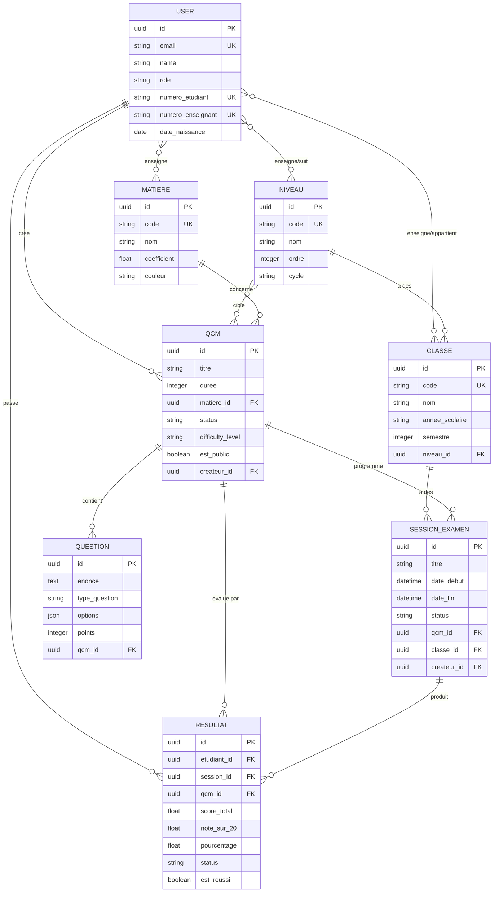
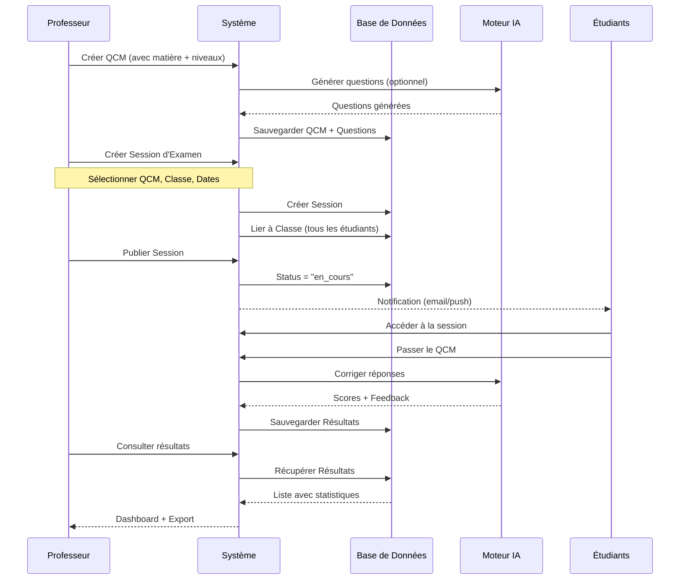

# Modèle Éducatif Complet - AI-KO

## Vue d'Ensemble

Ce document décrit le **modèle de données complet** pour le système de gestion d'examens universitaires AI-KO, incluant les professeurs, étudiants, niveaux, matières, classes et sessions d'examen.

---

## 📋 Table des Matières

1. [Architecture du Modèle](#architecture-du-modèle)
2. [Entités Principales](#entités-principales)
3. [Relations Many-to-Many](#relations-many-to-many)
4. [Diagrammes](#diagrammes)
5. [Cas d'Usage](#cas-dusage)
6. [Exemples de Données](#exemples-de-données)

---

## Architecture du Modèle

### Principes de Conception

1. **Flexibilité académique**
   - Un professeur peut enseigner plusieurs matières
   - Un professeur peut enseigner à plusieurs niveaux
   - Un étudiant peut être inscrit à plusieurs niveaux (redoublement, double cursus)
   - Un étudiant peut suivre plusieurs classes

2. **Traçabilité temporelle**
   - Historique des affectations par année scolaire
   - Suivi des changements de niveau
   - Archivage des résultats

3. **Évaluation complète**
   - Sessions d'examen programmées
   - Résultats détaillés avec feedback IA
   - Notes et commentaires des professeurs

---

## Entités Principales

### 1. User (Utilisateur)

**Rôles:** ADMIN, PROFESSEUR/ENSEIGNANT, ETUDIANT

```python
class User:
    # Identité
    id: UUID
    email: String (unique)
    name: String
    password_hash: String
    role: Enum (ADMIN, ENSEIGNANT, ETUDIANT)

    # Informations complémentaires
    numero_etudiant: String (unique, nullable)
    numero_enseignant: String (unique, nullable)
    telephone: String
    adresse: Text
    date_naissance: Date

    # OAuth
    google_id: String (unique, nullable)
    avatar: String (URL)
    email_verified: Boolean

    # Relations
    matieres_enseignees: [Matiere]  # Many-to-Many (professeur)
    niveaux_enseignes: [Niveau]     # Many-to-Many (professeur)
    classes_enseignees: [Classe]    # Many-to-Many (professeur)
    niveaux_etudiants: [Niveau]     # Many-to-Many (étudiant)
    classes_etudiants: [Classe]     # Many-to-Many (étudiant)
    qcms_crees: [QCM]               # One-to-Many (créateur)
    resultats: [Resultat]           # One-to-Many (étudiant)
```

### 2. Niveau (Level)

**Exemples:** L1, L2, L3, M1, M2, Doctorat

```python
class Niveau:
    id: UUID
    code: String (unique)          # L1, L2, M1, etc.
    nom: String                    # Licence 1, Master 1
    description: Text
    ordre: Integer                 # Pour tri (L1=1, L2=2, etc.)
    cycle: String                  # licence, master, doctorat
    actif: Boolean

    # Relations
    professeurs: [User]            # Many-to-Many
    etudiants: [User]             # Many-to-Many
    classes: [Classe]             # One-to-Many
    qcms_associes: [QCM]          # Many-to-Many
```

### 3. Matiere (Subject)

**Exemples:** Mathématiques, Informatique, Physique

```python
class Matiere:
    id: UUID
    code: String (unique)          # MATH101, INFO201
    nom: String                    # Mathématiques Générales
    description: Text
    coefficient: Float             # Pour calcul de moyenne
    couleur: String (#HEX)        # Pour UI
    icone: String                  # Nom d'icône
    actif: Boolean

    # Relations
    professeurs: [User]            # Many-to-Many
    qcms: [QCM]                   # One-to-Many
```

### 4. Classe (Class/Group)

**Exemples:** L1-INFO-A, M2-MATH-B

```python
class Classe:
    id: UUID
    code: String (unique)          # L1-INFO-A
    nom: String                    # Licence 1 Informatique Groupe A
    description: Text
    annee_scolaire: String         # 2024-2025
    semestre: Integer (1 ou 2)
    effectif_max: Integer
    actif: Boolean

    # Relations
    niveau_id: FK(Niveau)          # Many-to-One
    niveau: Niveau
    etudiants: [User]             # Many-to-Many
    professeurs: [User]            # Many-to-Many
    sessions: [SessionExamen]      # One-to-Many
```

### 5. QCM (Quiz)

```python
class QCM:
    id: UUID
    titre: String
    description: Text
    duree: Integer (minutes)

    # Matière
    matiere: String                # DEPRECATED
    matiere_id: FK(Matiere)       # NEW
    matiere_obj: Matiere

    # Statut et visibilité
    status: Enum (draft, published, archived)
    difficulty_level: String       # facile, moyen, difficile
    est_public: Boolean

    # Relations
    createur_id: FK(User)
    createur: User
    questions: [Question]          # One-to-Many (cascade delete)
    niveaux: [Niveau]             # Many-to-Many
    sessions: [SessionExamen]      # One-to-Many
    resultats: [Resultat]         # One-to-Many
```

### 6. Question

```python
class Question:
    id: UUID
    enonce: Text
    type_question: Enum (qcm, vrai_faux, texte_libre)
    options: JSON                  # Pour QCM
    reponse_correcte: Text        # Pour vrai/faux et texte libre
    points: Integer
    explication: Text

    # Relations
    qcm_id: FK(QCM)
    qcm: QCM
```

### 7. SessionExamen (Exam Session)

```python
class SessionExamen:
    id: UUID
    titre: String
    description: Text

    # Planning
    date_debut: DateTime
    date_fin: DateTime
    duree_minutes: Integer

    # Configuration
    tentatives_max: Integer
    melange_questions: Boolean
    melange_options: Boolean
    afficher_correction: Boolean
    note_passage: Float

    # Statut
    status: Enum (programmee, en_cours, terminee, annulee)

    # Relations
    qcm_id: FK(QCM)
    qcm: QCM
    classe_id: FK(Classe) (nullable)
    classe: Classe
    createur_id: FK(User)
    createur: User
    resultats: [Resultat]         # One-to-Many
```

### 8. Resultat (Result)

```python
class Resultat:
    id: UUID

    # Identifiants
    etudiant_id: FK(User)
    etudiant: User
    session_id: FK(SessionExamen)
    session: SessionExamen
    qcm_id: FK(QCM)
    qcm: QCM

    # Passage
    numero_tentative: Integer
    date_debut: DateTime
    date_fin: DateTime (nullable)
    duree_reelle_secondes: Integer

    # Scores
    score_total: Float
    score_maximum: Float
    note_sur_20: Float
    pourcentage: Float

    # Statistiques
    questions_total: Integer
    questions_repondues: Integer
    questions_correctes: Integer
    questions_incorrectes: Integer
    questions_partielles: Integer

    # Détails
    reponses_detail: JSON          # Détails de chaque réponse

    # Statut
    status: Enum (en_cours, termine, abandonne, invalide)
    est_reussi: Boolean
    est_valide: Boolean           # Détection triche

    # Feedback
    feedback_auto: Text           # Feedback IA
    commentaire_prof: Text        # Commentaire prof
    note_prof: Float              # Note ajustée si nécessaire
```

---

## Relations Many-to-Many

### 1. professeur_matieres

**Un professeur enseigne plusieurs matières**

```
professeur_id: FK(User)
matiere_id: FK(Matiere)
annee_scolaire: String
created_at: DateTime
```

### 2. professeur_niveaux

**Un professeur enseigne à plusieurs niveaux**

```
professeur_id: FK(User)
niveau_id: FK(Niveau)
created_at: DateTime
```

### 3. etudiant_niveaux

**Un étudiant peut être à plusieurs niveaux (historique)**

```
etudiant_id: FK(User)
niveau_id: FK(Niveau)
annee_scolaire: String
est_actuel: Boolean
created_at: DateTime
```

### 4. etudiant_classes

**Un étudiant appartient à des classes**

```
etudiant_id: FK(User)
classe_id: FK(Classe)
annee_scolaire: String
est_actuelle: Boolean
created_at: DateTime
```

### 5. professeur_classes

**Un professeur enseigne à des classes**

```
professeur_id: FK(User)
classe_id: FK(Classe)
matiere_id: FK(Matiere) (nullable)
annee_scolaire: String
created_at: DateTime
```

### 6. qcm_niveaux

**Un QCM cible plusieurs niveaux**

```
qcm_id: FK(QCM)
niveau_id: FK(Niveau)
created_at: DateTime
```

---

## Diagrammes

### Diagramme Entité-Relation


```mermaid
erDiagram
    USER ||--o{ QCM : cree
    USER ||--o{ RESULTAT : passe
    USER }o--o{ MATIERE : enseigne
    USER }o--o{ NIVEAU : "enseigne/suit"
    USER }o--o{ CLASSE : "enseigne/appartient"

    NIVEAU ||--o{ CLASSE : "a des"
    NIVEAU }o--o{ QCM : "cible"

    MATIERE ||--o{ QCM : "concerne"

    CLASSE ||--o{ SESSION_EXAMEN : "a des"

    QCM ||--o{ QUESTION : contient
    QCM ||--o{ SESSION_EXAMEN : "programme"
    QCM ||--o{ RESULTAT : "evalue par"

    SESSION_EXAMEN ||--o{ RESULTAT : "produit"

    USER {
        uuid id PK
        string email UK
        string name
        string role
        string numero_etudiant UK
        string numero_enseignant UK
        date date_naissance
    }

    NIVEAU {
        uuid id PK
        string code UK
        string nom
        integer ordre
        string cycle
    }

    MATIERE {
        uuid id PK
        string code UK
        string nom
        float coefficient
        string couleur
    }

    CLASSE {
        uuid id PK
        string code UK
        string nom
        string annee_scolaire
        integer semestre
        uuid niveau_id FK
    }

    QCM {
        uuid id PK
        string titre
        integer duree
        uuid matiere_id FK
        string status
        string difficulty_level
        boolean est_public
        uuid createur_id FK
    }

    QUESTION {
        uuid id PK
        text enonce
        string type_question
        json options
        integer points
        uuid qcm_id FK
    }

    SESSION_EXAMEN {
        uuid id PK
        string titre
        datetime date_debut
        datetime date_fin
        string status
        uuid qcm_id FK
        uuid classe_id FK
        uuid createur_id FK
    }

    RESULTAT {
        uuid id PK
        uuid etudiant_id FK
        uuid session_id FK
        uuid qcm_id FK
        float score_total
        float note_sur_20
        float pourcentage
        string status
        boolean est_reussi
    }
```

### Flux de Données: Création d'une Session d'Examen


```mermaid
sequenceDiagram
    participant P as Professeur
    participant S as Système
    participant DB as Base de Données
    participant AI as Moteur IA

    P->>S: Créer QCM (avec matière + niveaux)
    S->>AI: Générer questions (optionnel)
    AI-->>S: Questions générées
    S->>DB: Sauvegarder QCM + Questions

    P->>S: Créer Session d'Examen
    Note over P,S: Sélectionner QCM, Classe, Dates
    S->>DB: Créer Session
    S->>DB: Lier à Classe (tous les étudiants)

    P->>S: Publier Session
    S->>DB: Status = "en_cours"
    S-->>Étudiants: Notification (email/push)

    Étudiants->>S: Accéder à la session
    Étudiants->>S: Passer le QCM
    S->>AI: Corriger réponses
    AI-->>S: Scores + Feedback
    S->>DB: Sauvegarder Résultats

    P->>S: Consulter résultats
    S->>DB: Récupérer Résultats
    DB-->>S: Liste avec statistiques
    S-->>P: Dashboard + Export
```

---

## Cas d'Usage

### 1. Professeur Multi-Matières Multi-Niveaux

**Scénario:**
- Prof. Martin enseigne **Mathématiques** et **Statistiques**
- Il enseigne en **L1**, **L2** et **M1**
- Il a 3 classes: L1-MATH-A, L2-STAT-B, M1-MATH-A

**Données:**
```python
prof_martin = User(
    name="Prof. Martin",
    role=UserRole.ENSEIGNANT,
    numero_enseignant="PROF001"
)

# Matières
math = Matiere(code="MATH101", nom="Mathématiques")
stat = Matiere(code="STAT201", nom="Statistiques")

# Niveaux
l1 = Niveau(code="L1", nom="Licence 1", cycle="licence", ordre=1)
l2 = Niveau(code="L2", nom="Licence 2", cycle="licence", ordre=2)
m1 = Niveau(code="M1", nom="Master 1", cycle="master", ordre=4)

# Relations
prof_martin.matieres_enseignees = [math, stat]
prof_martin.niveaux_enseignes = [l1, l2, m1]
```

### 2. Étudiant avec Redoublement

**Scénario:**
- Sophie a redoublé sa L1
- Elle est actuellement en L2

**Données:**
```python
sophie = User(
    name="Sophie Dubois",
    role=UserRole.ETUDIANT,
    numero_etudiant="ETU20241234"
)

# Historique niveaux
etudiant_niveaux = [
    {
        'etudiant_id': sophie.id,
        'niveau_id': l1.id,
        'annee_scolaire': '2023-2024',
        'est_actuel': False  # Passé
    },
    {
        'etudiant_id': sophie.id,
        'niveau_id': l1.id,
        'annee_scolaire': '2024-2025',
        'est_actuel': False  # Redoublement
    },
    {
        'etudiant_id': sophie.id,
        'niveau_id': l2.id,
        'annee_scolaire': '2025-2026',
        'est_actuel': True   # Actuel
    }
]
```

### 3. Session d'Examen Programmée

**Scénario:**
- QCM de Mathématiques pour la classe L1-MATH-A
- 60 minutes, 20 questions
- Programmé du 15/06/2025 8h au 15/06/2025 18h

**Données:**
```python
session = SessionExamen(
    titre="Examen Final Mathématiques L1",
    qcm=qcm_math_l1,
    classe=classe_l1_math_a,
    date_debut=datetime(2025, 6, 15, 8, 0),
    date_fin=datetime(2025, 6, 15, 18, 0),
    duree_minutes=60,
    tentatives_max=1,
    note_passage=10.0,
    status='programmee',
    createur=prof_martin
)
```

### 4. Résultat d'Étudiant

**Scénario:**
- Sophie passe l'examen
- Elle obtient 15.5/20
- Correction automatique + commentaire du prof

**Données:**
```python
resultat = Resultat(
    etudiant=sophie,
    session=session,
    qcm=qcm_math_l1,
    numero_tentative=1,
    date_debut=datetime(2025, 6, 15, 9, 0),
    date_fin=datetime(2025, 6, 15, 10, 0),
    duree_reelle_secondes=3600,
    score_total=31.0,
    score_maximum=40.0,
    note_sur_20=15.5,
    pourcentage=77.5,
    questions_total=20,
    questions_repondues=20,
    questions_correctes=15,
    questions_incorrectes=3,
    questions_partielles=2,
    status='termine',
    est_reussi=True,
    feedback_auto="Très bon travail ! Vous maîtrisez bien les concepts.",
    commentaire_prof="Excellent, continuez ainsi !",
    note_prof=None  # Pas d'ajustement
)
```

---

## Requêtes Fréquentes

### 1. Récupérer tous les étudiants d'une classe

```python
classe = Classe.query.filter_by(code='L1-MATH-A').first()
etudiants = classe.etudiants.all()
```

### 2. Récupérer toutes les matières d'un professeur

```python
prof = User.query.filter_by(numero_enseignant='PROF001').first()
matieres = prof.matieres_enseignees.all()
```

### 3. Récupérer tous les QCM d'un niveau

```python
niveau = Niveau.query.filter_by(code='L1').first()
qcms = niveau.qcms_associes.all()
```

### 4. Récupérer les résultats d'un étudiant

```python
etudiant = User.query.filter_by(numero_etudiant='ETU20241234').first()
resultats = etudiant.resultats.order_by(Resultat.date_debut.desc()).all()
```

### 5. Statistiques d'une session

```python
session = SessionExamen.query.get(session_id)
resultats = session.resultats.all()

stats = {
    'participants': len(resultats),
    'moyenne': sum(r.note_sur_20 for r in resultats) / len(resultats),
    'reussite': len([r for r in resultats if r.est_reussi]),
    'taux_reussite': len([r for r in resultats if r.est_reussi]) / len(resultats) * 100
}
```

---

## Migration depuis l'Ancien Modèle

### Compatibilité Ascendante

Le champ `QCM.matiere` (texte) est conservé pour la compatibilité mais **deprecated**.

**Migration:**
```python
# Créer les matières à partir des QCM existants
matieres_texte = db.session.query(QCM.matiere).distinct().all()

for (matiere_nom,) in matieres_texte:
    if matiere_nom:
        code = matiere_nom.upper().replace(' ', '_')[:20]
        matiere = Matiere(code=code, nom=matiere_nom)
        db.session.add(matiere)

db.session.commit()

# Lier les QCM aux matières
for qcm in QCM.query.all():
    if qcm.matiere:
        matiere = Matiere.query.filter_by(nom=qcm.matiere).first()
        if matiere:
            qcm.matiere_id = matiere.id

db.session.commit()
```

---

## Avantages du Nouveau Modèle

### 1. Flexibilité

✅ Un professeur peut enseigner plusieurs matières et niveaux
✅ Un étudiant peut changer de niveau (redoublement, passerelle)
✅ Historique complet des affectations

### 2. Traçabilité

✅ Suivi par année scolaire
✅ Archivage des sessions et résultats
✅ Détection de fraude (champ `est_valide`)

### 3. Évaluation Complète

✅ Sessions programmées avec configuration avancée
✅ Tentatives multiples
✅ Feedback IA + commentaires professeur
✅ Statistiques détaillées

### 4. Scalabilité

✅ Support multi-établissements (via classes)
✅ Gestion de milliers d'étudiants
✅ Optimisation des requêtes (lazy loading, indexes)

---

## Prochaines Évolutions

### Court Terme
- [ ] Import/Export CSV d'étudiants et classes
- [ ] Notifications en temps réel (WebSocket)
- [ ] Calendrier des sessions

### Moyen Terme
- [ ] Groupes de travail (TP)
- [ ] Projets étudiants
- [ ] Badges et certifications

### Long Terme
- [ ] Support multi-établissements
- [ ] Intégration ENT
- [ ] API publique pour intégrations tierces

---

**Version:** 1.0
**Date:** Janvier 2025
**Auteur:** Équipe AI-KO
